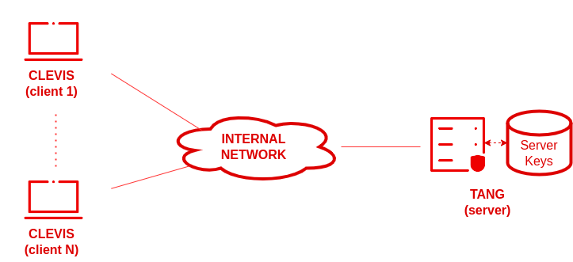
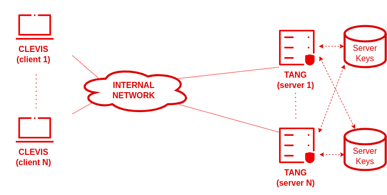
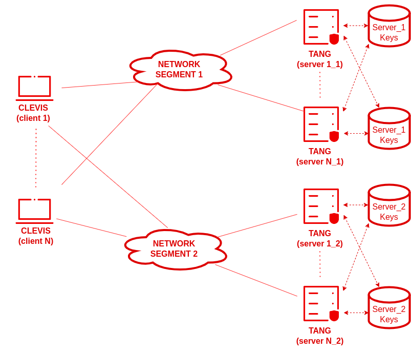

# Limitations and Improvements
This document identifies the known limitations of the current MVP implementation and proposes concrete improvement paths for each one.
> **Current deployment model**: Simple scenario, one Tang server, one client, single network segment.  

<a href="https://access.redhat.com/articles/6987053" target="_blank">NBDE Red Hat</a>

## Table of contents
1. [Infrastructure limitations](#1-infrastructure-limitations)
2. [Physical security limitations](#2-physical-security-limitations)
3. [insider threat - administrative access](#3-insider-threat--administrative-access)
4. [key management limitations](#4-key-management-limitations)
5. [device outside the corporate network](#5-device-outside-the-corporate-network)
## 1. Infrastructure limitations

### 1.1 Single point of failure: Tang Server
**Limitation**

The current setup relies on a single Tang server. If that server becomes unavailable (crash, network outage, planned maintenance), **all bound clients are blocked from booting automatically**. They will retry indefinitely until the Tang server comes back.

**Improvement: Load-balanced Tang servers**

Add a second network segment, each with its own Tang server. Clevis is configured with an SSS pin that requires a threshold across both segments. This eliminates both the single-server and single-segment failure points:

<a href="https://access.redhat.com/articles/6987053" target="_blank">NBDE Red Hat</a>

### 1.2 Single network segment
**Limitation**

A network outage on the single LAN segment simultaneously cuts off the Tang server and prevents clients from booting. There is no fallback path.

**Improvement**

Redundant network segments and/or a secondary network interface on the client (bonding / failover) configured in the initramfs network hook.

<a href="https://access.redhat.com/articles/6987053" target="_blank">NBDE Red Hat</a>

### 1.3 Tang server running in Docker
**Limitation**

The Tang server is containerized with minimal configuration: no authentication, no firewall rules defined in the project, no SELinux policy. Anyone with LAN access can query it.

**Improvement**

- Restrict access to port 7500 to the known client subnet via firewall rules
- Deploy Tang on a dedicated, hardened VM with SELinux in enforcing mode (as recommended in <a href="https://docs.redhat.com/en/documentation/red_hat_enterprise_linux/8/html/security_hardening/index" target="_blank">RHEL documentation</a> ).

## 2. Physical security limitations

### 2.1 Theft of a client machine while powered on
**Limitation**

If a machine is stolen while already **booted and running**, the disk is unlocked and data is accessible. LUKS only protects data at rest, it cannot protect a live, running system.

**Improvement**

- Enforce automatic screen locking and session timeout
- Use full RAM encryption (Intel TME) for in-memory data protection.

### 2.2 Theft of device + eventual Tang server compromise
**Limitation**

If an attacker steals the device and later gains access to the Tang server (or its key material), they can reconstruct both shares and decrypt the disk.

**Improvement**

Immediately perform key rotation upon detecting any theft or suspected compromise:
1. Generate new keys on the Tang server.
2. Rebind all remaining clients.
3. Delete the old keys only after all clients are rebound.

## 3. Insider threat / Administrative access

### 3.1 Administrator access to Tang private keys
**Limitation**

The Tang server's private keys are stored in /var/tang (or in the tang-keys Docker volume). A system administrator with access to the Tang server can extract these keys and, combined with a stolen client disk, decrypt the data offline.

**Improvement**

- Store Tang private keys in a Hardware Security Module (HSM) so they never exist in plaintext on disk.
- Apply role separation: the admin who manages the Tang server should not have physical access to client machines, and vice versa.
- Enable audit logging on the Tang server to record all access to the key directory.

### 3.2 No audit trail
**Limitation**

In the current setup, there is no logging of when a client successfully (or unsuccessfully) contacts the Tang server to unlock its disk. An unauthorized unlock goes undetected.

**Improvement**

Tang logs all client connections natively via `systemd-journald`. Each unlock attempt appears as a journal entry containing the client IP, the HTTP method and key ID.
- Ensure journald stores logs persistently (survives reboots) and with retention: <a href="https://docs.redhat.com/en/documentation/red_hat_enterprise_linux/7/html/automating_system_administration_by_using_rhel_system_roles_in_rhel_7.9/configuring-the-systemd-journal-by-using-the-journald-rhel-system-role_automating-system-administration-by-using-rhel-system-roles" target="_blank">journald RHEL System Role</a> 

- Forward Tang logs to a remote syslog server or SIEM (ex. Graylog) so that logs are tamper-resistant even if the Tang host is compromised.

## 4. Key management limitations

### 4.1 Manual recovery 
**Limitation**

If the Tang server is unreachable (network outage, maintenance), the only way to boot a client is to manually type the LUKS passphrase. This passphrase is the emergency fallback registered in the LUKS keyslot during initial setup. Communicating it to an on-site operator exposes it.

**Improvement**

- Store the emergency passphrase in a password vault (ex. HashiCorp Vault) with access controls and audit logging.

## 5. Device outside the corporate network
This section covers limitations that arise when a device leaves the corporate LAN. For example, an employee working from home, travelling, or simply rebooting in a location where the Tang server is unreachable.

### 5.1 Fundamental incompatibility: NBDE requires network presence by design

**Limitation**

NBDE is built around a core security principle: **the disk can only be unlocked when the device is present on the trusted network**. An employee who takes their laptop home and reboots it will not be able to unlock the disk automatically, regardless of any other configuration.

As Red Hat's documentation states explicitly, giving remote access to the Tang network via VPN or other means is counter to the intent of NBDE: the entire point is that an attacker who steals the device and gains network access can decrypt the disk, so the Tang network must remain strictly controlled.
>"Due to the necessity of limited access to the Tang network, the technician should not be able to access that network via VPN or other remote means." <a href="https://docs.redhat.com/en/documentation/openshift_container_platform/4.9/html/security_and_compliance/network-bound-disk-encryption-nbde" target="_blank">OpenShift NBDE</a>

**Improvement**

The recommended approach for a production deployment is to never allow the Tang network to be reachable from outside the corporate perimeter, and to train users that a remote reboot prevent them from reconnecting to their device.

| Approach | Security trade-off | Notes |
|---|---|---|
| **Manual LUKS passphrase** | Passphrase must be communicated securely | Emergency fallback, requires a password vault |
| **VPN pre-boot unlock** | Opens Tang network to remote access, widens attack surface significantly | Contradicts NBDE's threat model |

### 5.2 LUKS master key remains in memory

**Limitation**

When a running system enters **sleep**, the CPU is halted but the RAM keeps its power. The LUKS master key, loaded into kernel memory at unlock time by dm-crypt, stays in RAM in plaintext for the entire duration of the sleep.

This is not a LUKS format limitation but a dm-crypt / kernel behavior: the key must remain in memory so the device can resume instantly without going through the full unlock sequence again.

**Improvement**

`cryptsetup luksSuspend` exists to flush the master key from memory before entering sleep, but applying it to the root device is highly non-trivial: the kernel itself runs from the encrypted root, so the system must first pivot to a minimal RAM environment (an initramfs chroot) before it can freeze dm-crypt. Projects like go-luks-suspend implement this for Arch Linux. <a href="https://github.com/guns/go-luks-suspend" target="_blank">Go luks suspend</a>

### 5.3 Hibernate: RAM image written to swap in plaintext

**Limitation**

Hibernation works by dumping the entire RAM contents to the swap partition on disk, then cutting power. On resume, the kernel reloads this image and continues where it left off.

If the swap partition is not independently encrypted, the hibernation image, which includes the LUKS master key in memory, is written in plaintext to disk. This completely defeats full-disk encryption: an attacker who obtains the disk after a hibernate cycle can extract the LUKS key directly from the swap area, without needing Tang or the TPM.

**Improvement**

- Disable hibernation entirely to eliminate the risk.