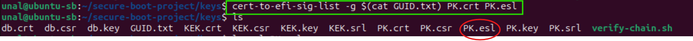
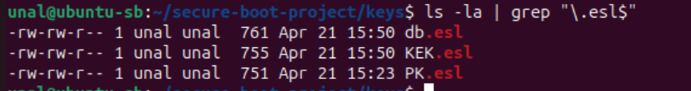
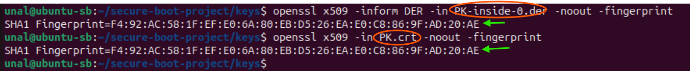
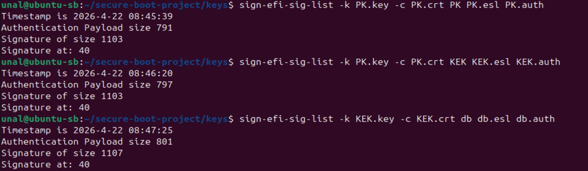
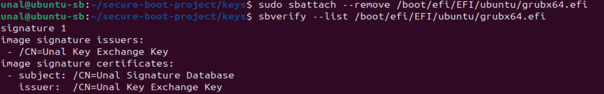
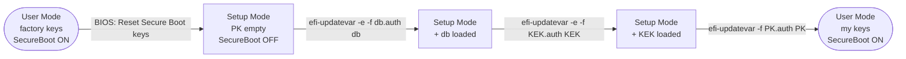

# EFI Format Conversion and UEFI Enrollment

**Author:** Unal Külekci

> **Note on paths:** Examples use my project layout (`~/secure-boot-project/` for keys, `/boot/efi/EFI/Linux/my_ubuntu.efi` for the UKI). Adjust to your own paths when following along.

> This file continues from `key_generation.md` Step 8.6. For key generation see: [key_generation.md](key_generation.md)

## Step 9 — Converting Certificates to EFI Signature List (.esl)

> **Script:** [`scripts/convert_keys_to_efi.sh`](scripts/convert_keys_to_efi.sh) automates Steps 9 and 10.

UEFI does not understand standard X.509 certificates. It requires its own binary format: **EFI Signature List (ESL)**. The ESL wraps the X.509 certificate in an envelope that adds:

- **Owner GUID** — who owns this key (our GUID from Step 8.1)
- **Signature Type** — what kind of data this is (X.509 certificate or SHA256 hash)
- **Size info** — so UEFI can parse the binary structure

```
X.509 (.crt)                    ESL (.esl)
┌─────────────────┐             ┌──────────────────────────┐
│ Subject: CN=... │   →→→       │ [ESL Header]             │
│ Public Key      │             │   Type: X509             │
│ Signature       │             │   Size: ...              │
│                 │             │ [Owner GUID]             │
└─────────────────┘             │ [Certificate content]    │
                                └──────────────────────────┘
```

### 9.1 — Convert all three certificates

Run these commands from `~/secure-boot-project/keys/` (where `GUID.txt` was created in [key_generation.md](key_generation.md) Step 8.1).

```bash
cert-to-efi-sig-list -g $(cat GUID.txt) PK.crt PK.esl
cert-to-efi-sig-list -g $(cat GUID.txt) KEK.crt KEK.esl
cert-to-efi-sig-list -g $(cat GUID.txt) db.crt db.esl
```



- `-g $(cat GUID.txt)` — use our GUID as the owner identifier. `$(cat GUID.txt)` is bash command substitution: it reads the file content and inserts it inline.
- All three commands use the **same GUID**. We are the sole platform owner — PK, KEK, and db all belong to us. In a multi-party environment (e.g., Dell PK + Microsoft KEK + corporate db), each organization would use its own GUID for audit traceability. In our project, a single GUID is the correct choice.


After running all three commands, each certificate produces its corresponding `.esl` file:



### 9.2 — Verifying the ESL content

To confirm the ESL actually contains our original certificate, we can extract it back and compare fingerprints:

```bash
# Extract the certificate from the ESL (outputs DER format)
sig-list-to-certs PK.esl PK-inside

# Compare fingerprints: extracted vs original
openssl x509 -inform DER -in PK-inside-0.der -noout -fingerprint
openssl x509 -in PK.crt -noout -fingerprint
```



Both SHA1 fingerprints are identical — this proves the ESL correctly wraps our original PK certificate.

> **Note on `.der` vs `.crt`:** `sig-list-to-certs` outputs in DER (binary) format with a `.der` extension. `.crt` files can be either PEM (text) or DER (binary) — the extension does not guarantee the format. `.der` is always binary, `.pem` is always text.

## Step 10 — Creating Authenticated Variables (.auth)

UEFI does not accept unsigned ESL files — it needs proof that the update is authorized. We create **authenticated variables** by signing the ESL files:

| Variable | Signed by | Why |
|---|---|---|
| `PK.auth` | PK itself (self-signed) | PK is the root — no one above it to sign |
| `KEK.auth` | PK | PK authorizes who can be in KEK |
| `db.auth` | KEK | KEK authorizes what goes into db |

This mirrors the trust hierarchy: PK → KEK → db.

### 10.1 — Sign the ESL files

```bash
# PK signs itself
sign-efi-sig-list -g $(cat GUID.txt) -k PK.key -c PK.crt PK PK.esl PK.auth

# PK signs KEK
sign-efi-sig-list -g $(cat GUID.txt) -k PK.key -c PK.crt KEK KEK.esl KEK.auth

# KEK signs db
sign-efi-sig-list -g $(cat GUID.txt) -k KEK.key -c KEK.crt db db.esl db.auth
```




Parameters:
- `-k` — private key used for signing
- `-c` — certificate of the signer
- Third argument (`PK`, `KEK`, `db`) — the UEFI variable name this is destined for
- Input: `.esl` file
- Output: `.auth` file

### 10.2 — Verify the output

```bash
ls -la *.auth
```

The `.auth` files are ready to be loaded into UEFI. This is the final format that `efi-updatevar` accepts.

## Step 11 — Signing Boot Components

> **Script:** [`scripts/sign_boot.sh`](scripts/sign_boot.sh) automates this step.

Before loading our keys into UEFI, we must first sign GRUB and the kernel with our db key. If we load our keys first without signing, the system will refuse to boot — because the current GRUB and kernel are signed by Canonical, and our UEFI will no longer trust Canonical.

### 11.1 — Sign GRUB

GRUB ships with Canonical's signature. To leave only my own signature on `grubx64.efi`, I strip the existing signature table first, then re-sign:

```bash
# 1. Strip all existing signatures (Canonical's)
sudo sbattach --remove /boot/efi/EFI/ubuntu/grubx64.efi

# 2. Sign with my db key
sudo sbsign --key db.key --cert db.crt \
  --output /boot/efi/EFI/ubuntu/grubx64.efi \
  /boot/efi/EFI/ubuntu/grubx64.efi
```

Verify:

```bash
sbverify --list /boot/efi/EFI/ubuntu/grubx64.efi
```



The output shows only my certificate (`CN=Unal Signature Database`, issued by `CN=Unal Key Exchange Key`).

> **Note:** `sbattach --remove` strips the **entire** signature table. To delete one specific signature while keeping the others, use `pesign` with an index:
>
> ```bash
> sudo apt install -y pesign
> pesign -i grubx64.efi -S                              # list signatures with index
> sudo pesign -i grubx64.efi -o /tmp/g.efi -r -u 1      # remove index 1
> sudo cp /tmp/g.efi grubx64.efi
> ```

#### Keep or remove the Canonical signature?

- **Keep:** the binary still verifies under factory UEFI (useful for recovery or dual-boot fallback).
- **Remove:** `sbverify --list` is cleaner and the trust chain is fully mine.

In this project I enroll only my own PK/KEK/db, so Canonical's signature becomes unverifiable once enrollment is done — UEFI no longer trusts that CA. Removing it is cosmetic at that point but matches the project's "take full ownership" goal.

### 11.2 — Sign the kernel

```bash
sudo sbsign --key db.key --cert db.crt --output /boot/vmlinuz-$(uname -r) /boot/vmlinuz-$(uname -r)
```

Verify:

```bash
sudo sbverify --list /boot/vmlinuz-$(uname -r)
```

### 11.3 — Verify both signatures

```bash
sbverify --cert db.crt /boot/efi/EFI/ubuntu/grubx64.efi
sudo sbverify --cert db.crt /boot/vmlinuz-$(uname -r)
```

Both should output `Signature verification OK`. This confirms that GRUB and kernel are now signed with our db key.

## Step 12 — Loading Keys into UEFI



In **User Mode** UEFI rejects unsigned key updates. To install my own PK I need **Setup Mode**, where PK is empty and the firmware accepts any payload.

Setup Mode is entered from the BIOS/UEFI menu ("Reset to Setup Mode" or "Clear Secure Boot keys"). The OS cannot trigger it on its own.

> **Note:** VirtualBox does not allow Setup Mode, so Step 12 cannot be completed inside the VM. Real hardware is needed.

> **WARNING:** PK must be loaded **last**. Once PK is set, UEFI exits Setup Mode and enforces Secure Boot. If GRUB and kernel are not signed first, the system will not boot.

### 12.1 — Confirm Setup Mode

```bash
sudo efi-readvar -v PK    # should show no entries
```

If PK still has entries, the firmware is in User Mode — go back to BIOS and trigger the reset option.

### 12.2 — Load keys (order: db → KEK → PK)

```bash
# Load db
sudo efi-updatevar -e -f db.auth db

# Load KEK
sudo efi-updatevar -e -f KEK.auth KEK

# Load PK (this exits Setup Mode)
sudo efi-updatevar -f PK.auth PK
```

> **Note:** `-e` (append/ESL mode) for db and KEK because both can hold multiple entries. PK has a single entry, so `-f` alone is enough.

### 12.3 — Verify

```bash
sudo efi-readvar
```

All variables should now show our certificates instead of Oracle/Microsoft/Canonical.

## Step 13 — Reboot and Validation

```bash
sudo reboot
```

After reboot, verify:

```bash
# Secure Boot still active?
mokutil --sb-state

# Our keys are loaded?
sudo efi-readvar

# Save the "after" report
mkdir -p ~/secure-boot-project/after
sudo efi-readvar > ~/secure-boot-project/after/uefi-keys-after.txt
```

Compare with the "before" report from Step 7 to confirm the transition from Oracle/Microsoft/Canonical to our own keys.


## References

- [UEFI Specification 2.10 — Secure Boot and Driver Signing](https://uefi.org/specs/UEFI/2.10/32_Secure_Boot_and_Driver_Signing.html) — authoritative spec.
- [Arch Wiki — UEFI Secure Boot](https://wiki.archlinux.org/title/Unified_Extensible_Firmware_Interface/Secure_Boot) — practical guide for enrolling custom keys and signing boot components.
- [James Bottomley — Updating PK, KEK, db and dbx in User Mode](https://blog.hansenpartnership.com/updating-pk-kek-db-and-dbx-in-user-mode/) — directly relevant to Step 12.
- [pesign(1)](https://manpages.ubuntu.com/manpages/noble/man1/pesign.1.html) — used in Step 11.1 for surgical signature removal.
- [Claude AI (Anthropic)](https://claude.ai) — used as an interactive assistant for explanations, troubleshooting, and structuring this document.