# Key Generation

**Author:** Unal Külekci

> **Note on paths:** Examples use my project layout (`~/secure-boot-project/` for keys, `/boot/efi/EFI/Linux/my_ubuntu.efi` for the UKI). Adjust to your own paths when following along.

> This is the hands-on part of taking ownership of the UEFI trust chain. It follows from [setup-and-baseline.md](setup-and-baseline.md), which covers the VM setup, Ubuntu install, Secure Boot checks, and the "before" snapshot of the current UEFI keys.

## Conversion Pipeline

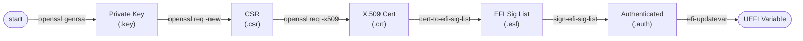

A key starts as a private key file and ends up as a UEFI variable. Each format has its own job:

| Format | What it is | Why I need it |
|---|---|---|
| `.crt` (X.509) | The standard certificate. It holds the subject, public key, and issuer. | This is what OpenSSL produces directly. |
| `.esl` (EFI Signature List) | UEFI's own key format. It wraps the X.509 in an envelope: owner GUID + type info + certificate. | UEFI can store many keys in one file and mix types (X.509, SHA-256 hash). |
| `.auth` (Authenticated) | An ESL plus a digital signature. | UEFI does not accept unsigned variable updates, except in Setup Mode. |

> **Script:** [`scripts/generate_keys.sh`](scripts/generate_keys.sh) automates Steps 8.1–8.5.

## Step 8.1 — GUID Generation

```bash
mkdir -p ~/secure-boot-project/keys
cd ~/secure-boot-project/keys
uuidgen > GUID.txt
```

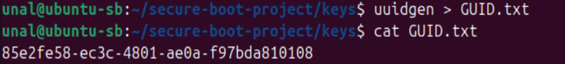

UEFI tags every key owner with a GUID. Later, when I turn my certificates into `.esl` format, each entry needs an owner GUID. All my keys (PK, KEK, db) share the same GUID because they all belong to me.

## Step 8.2 — PK (Platform Key) Generation

I create three files for PK: a private key, a CSR, and a certificate. Each step depends on the previous one:

```
Private Key (.key) → CSR (.csr) → Certificate (.crt)
```

- **Private key** — the secret source. The public key is derived from it and it signs everything.
- **CSR** — packs my identity (CN) and public key into a "sign me, please" request.
- **Certificate** — the final product. The CSR signed and stamped with a validity period. This is what UEFI will trust.

### 8.2.1 Private Key

```bash
openssl genrsa -out PK.key 2048
```

I create a 2048-bit RSA private key first because everything else depends on it: the public key inside the CSR comes from it, the CSR is signed by it, and the certificate is signed by it. This key must stay under my control and never be exposed to an untrusted system.

> **MVP note:** For this project, all private keys live on a removable USB drive — `~/secure-boot-project/keys/` is the USB mount point. See [Step 8.5](#step-85--private-key-security) for details.

Reference: [openssl-genrsa manual](https://docs.openssl.org/master/man1/openssl-genrsa/)

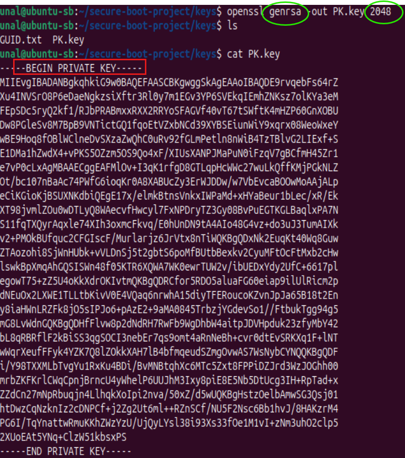

### 8.2.2 CSR (Certificate Signing Request)

```bash
openssl req -new -key PK.key -out PK.csr -subj "/CN=Unal Platform Key"
```

A CSR is a "please sign a certificate with this identity" request. Normally I would send it to a public Certificate Authority (Verisign, Let's Encrypt, etc.) and they would issue the certificate. But here I am my own CA — I sign the CSR myself.

After running the command, I list the files with `ls` and read the Base64-encoded CSR with `cat PK.csr`:

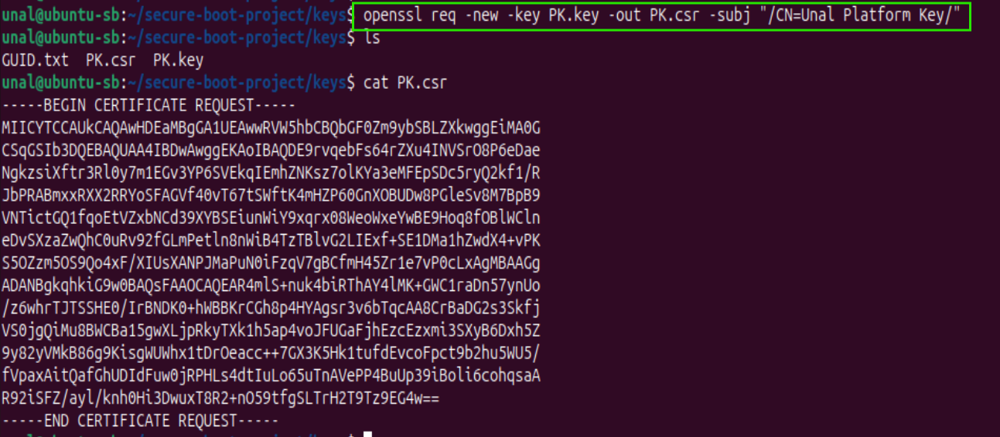

**What is inside a CSR?** I can read it in plain form with `openssl req -in PK.csr -text -noout`:

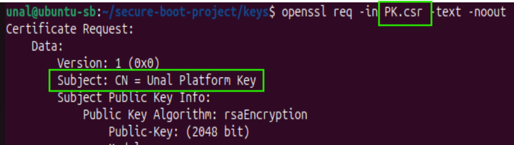

| Field | Description |
|---|---|
| **Subject (CN)** | Identity info. Mine: `CN=Unal Platform Key` |
| **Public Key** | Derived from the private key (`rsaEncryption`, 2048-bit) |
| **Signature Algorithm** | The algorithm used to sign (`sha256WithRSAEncryption`) |
| **Signature Value** | Proof that the CSR is intact and comes from the right owner |

**How is the Signature Value made?** The CSR content (CN, public key, etc.) is hashed with SHA-256, and that hash is then encrypted with the private key. The result is the Signature Value. This signature proves two things:

- The request really comes from the owner of the private key.
- No one has changed the content.

```
CSR content (CN + public key)  →  SHA-256  →  hash  →  encrypt with private key  →  Signature Value
```

The screenshot below shows the `sha256WithRSAEncryption` algorithm and the Signature Value it produced:

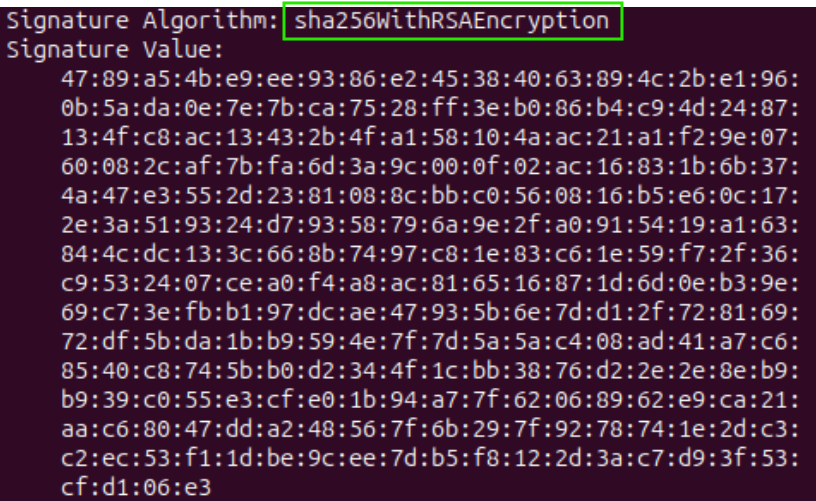

**Why does the CSR come before the certificate?** Certificate = CSR + signature. The fields written into the certificate (CN, public key) come from the CSR. I cannot build a certificate without a CSR — the CSR is the raw material.

### 8.2.3 Self-Signed Certificate

```bash
openssl req -x509 -key PK.key -in PK.csr -out PK.crt -days 3650 -sha256
```

This command takes the CSR, adds a validity period (`-days 3650` = 10 years), and signs it. The result is a certificate. Because I sign it with my own private key, it is self-signed — Issuer and Subject are the same person: me.

### 8.2.4 Verification

My certificate is in **X.509** format — the standard format for public-key certificates, used across TLS, Secure Boot, code signing, and more. X.509 defines a fixed structure: who the certificate belongs to, who signed it, when it expires, and the public key it carries.

```bash
openssl x509 -in PK.crt -text -noout | head -15
```

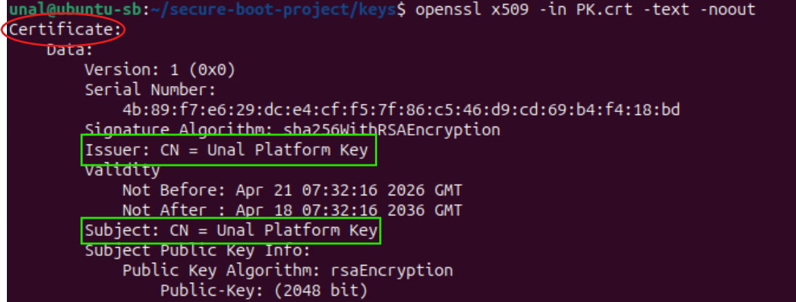

**What did the certificate gain on top of the CSR?**

| Field | In CSR | In Certificate | Description |
|---|---|---|---|
| **Subject** | yes | yes | Who the certificate belongs to (`CN=Unal Platform Key`) |
| **Public Key** | yes | yes | Carried over from the CSR |
| **Issuer** | no | yes | Who signed the certificate. In a self-signed cert, this is the same as Subject |
| **Validity** | no | yes | Not Before / Not After dates (`-days 3650` = 10 years) |
| **Serial Number** | no | yes | A unique ID for this certificate |
| **Signature** | ownership proof | CA approval | The CSR signature proves ownership; the certificate signature is the CA's (here, my own) approval stamp |

## Step 8.3 — KEK (Key Exchange Key) Generation

The KEK sits between PK and db in the trust tree. It is the key that is allowed to update the db and dbx variables — without a valid KEK signature, UEFI refuses any change to the trusted/forbidden signature databases.

Why have a separate key for this? Because each level should have its own private key:

- **Separation of duties:** PK is used rarely (only to approve KEK), KEK is used sometimes (to update db/dbx), and db is used a lot (to sign the bootloader and kernel).
- **Key rotation:** If the db key is leaked, I generate a new db key and sign it with KEK. PK and KEK stay safe, and the system stays secure.
- **Smaller blast radius:** If the KEK is stolen, the attacker can only touch db/dbx. PK is still safe.

The first two steps are the same as for PK (private key → CSR). The third step is different: instead of signing with itself, I sign the KEK's CSR with **PK's private key**. This is what builds the trust chain.

```bash
# 1. Private key
openssl genrsa -out KEK.key 2048

# 2. CSR
openssl req -new -key KEK.key -out KEK.csr -subj "/CN=Unal Key Exchange Key"

# 3. Certificate signed by PK (not self-signed)
openssl x509 -req -in KEK.csr -CA PK.crt -CAkey PK.key -CAcreateserial -out KEK.crt -days 3650 -sha256
```

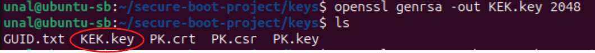

Compared with PK signing:

| | PK (self-signed) | KEK (signed by PK) |
|---|---|---|
| Command difference | `-key PK.key -in PK.csr` | `-CA PK.crt -CAkey PK.key` |
| Meaning | Sign with my own private key | Use PK as the Certificate Authority |
| Extra | — | `-CAcreateserial` creates a serial-number file (`PK.srl`) |

> **What is `-CAcreateserial`?** Every certificate needs a unique serial number so that revocation lists (CRL) work properly. This flag creates a `PK.srl` file that keeps track of serial numbers. The next time PK signs something (for db), the number goes up by one on its own.

Verification:

```bash
openssl x509 -in KEK.crt -text -noout | head -15
```

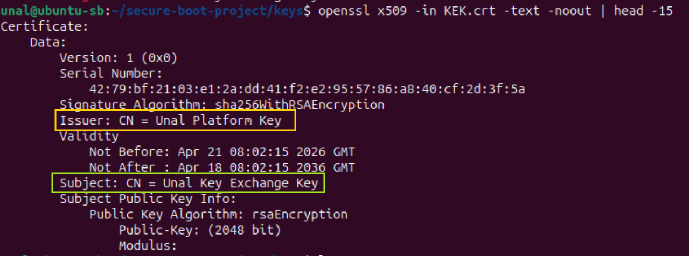

Unlike PK, Issuer and Subject are now **different**:

- **Issuer:** `CN=Unal Platform Key` — PK signed this certificate.
- **Subject:** `CN=Unal Key Exchange Key` — the certificate belongs to KEK.

This proves KEK is not self-signed. Its authority comes from PK.

## Step 8.4 — db (Signature Database) Key Generation

The db key does most of the daily work. PK and KEK are set up once and barely touched again, but db is used to sign every bootloader and kernel:

- `grubx64.efi` → signed with `db.key`
- `vmlinuz-*` → signed with `db.key`
- Future kernel updates → re-signed with `db.key`

At boot time, UEFI asks: "Is this file signed by a key that is in my db?" Yes → boot. No → refuse.

```bash
# 1. Private key
openssl genrsa -out db.key 2048

# 2. CSR
openssl req -new -key db.key -out db.csr -subj "/CN=Unal Signature Database"

# 3. Certificate signed by KEK (not PK, not self-signed)
openssl x509 -req -in db.csr -CA KEK.crt -CAkey KEK.key -CAcreateserial -out db.crt -days 3650 -sha256
```

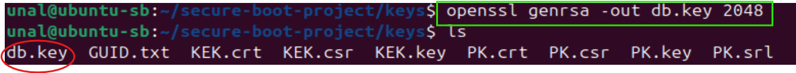

> **Note on `openssl genrsa`:** This command creates an RSA private key. The `.key` file actually holds **both** the private and the public parts: modulus (N), public exponent (e = 65537), private exponent (d), and the prime factors (p, q). The public key is just a subset of this data: (N, e). When I create a CSR later, OpenSSL pulls the public key out of this file automatically — I do not need a separate export step.

> **Security note:** Running `openssl rsa -in db.key -text -noout` prints the full RSA math, including the secret private exponent and the prime factors. This is fine for learning, but I must never share that output. To see only the public part: `openssl rsa -in db.key -pubout`.

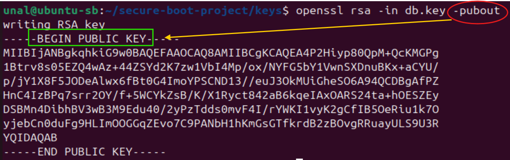

The difference from KEK: the signing authority moves one level down.

| | KEK (previous step) | db (this step) |
|---|---|---|
| `-CA` | `PK.crt` | `KEK.crt` |
| `-CAkey` | `PK.key` | `KEK.key` |

Verification:

```bash
openssl x509 -in db.crt -text -noout | grep -E "Issuer:|Subject:"
```

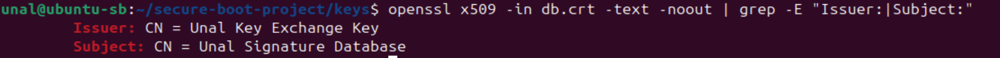

Issuer = KEK, Subject = db — the hierarchy is fully in place.

Expected files at this point:

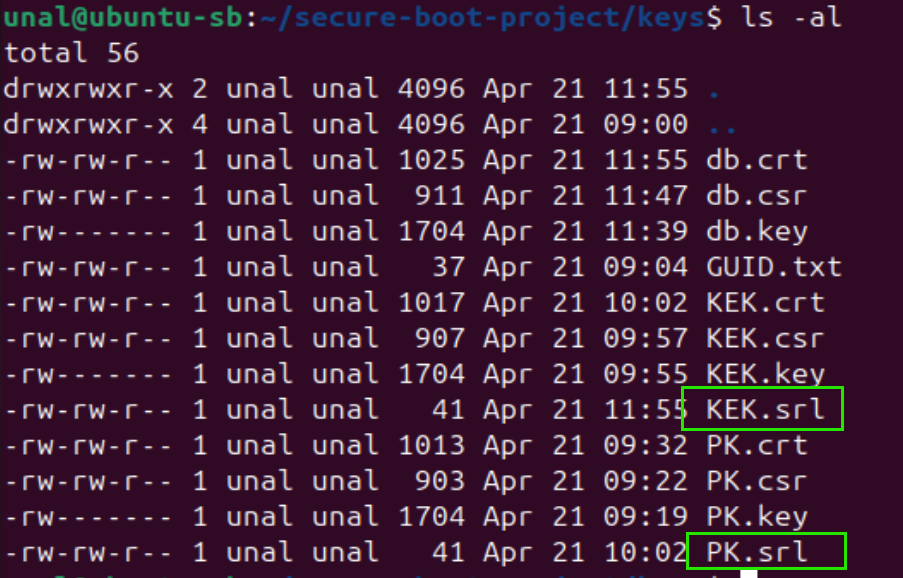

`PK.srl` was created when PK signed KEK. `KEK.srl` was created when KEK signed db. Each `.srl` file keeps track of serial numbers for the certificates issued by that CA.

The full trust chain is now built:

```
PK (self-signed)
 └── signed → KEK
                └── signed → db
                               └── will sign → grubx64.efi, vmlinuz, my_ubuntu.efi (UKI)
```

### Why I do NOT create dbx

dbx (Forbidden Signature Database) is a **blocklist**, not an allowlist. It holds hashes of known-vulnerable bootloaders. I do not generate a dbx because:

- There is nothing to block — all my keys and binaries are brand new.
- No older vulnerable versions exist on my system.
- Managing dbx is out of scope for Phase 3.

The tooling to update dbx is in place (my KEK can sign dbx updates), but I do not need it yet. In a real production system, if a bug were found in my signed bootloader, I would add its SHA-256 hash to dbx to block the bad version while rolling out a patched one.

## Step 8.5 — Private Key Security

**MVP approach (final):** I keep all private keys on a removable USB drive — `~/secure-boot-project/keys/` is the USB mount point. Plugged in only when signing or enrolling, unplugged otherwise. Keys never sit on the host disk.

**During in-VM testing** the keys lived on the VM disk. For that setup I tightened permissions:

```bash
chmod 700 ~/secure-boot-project/keys
chmod 600 ~/secure-boot-project/keys/*.key
```

- `700` on the folder: only my user can enter it.
- `600` on `.key` files: only my user can read them.

This stops other users on the system, but not a root-level attack. That gap is closed by the USB approach (this project) and later by Phase 4 (KMS).

| Environment | PK key | KEK key | db key |
|---|---|---|---|
| **Enterprise** | Air-gapped HSM | Physical HSM | KMS/TPM |
| **Small company** | USB hardware token (YubiKey) | USB hardware token | CI/CD encrypted vault |
| **This project (in-VM testing)** | VM disk + `chmod 600` | same | same |
| **This project (MVP)** | USB drive, mounted only when signing | same | same |

## Step 8.6 — Trust Chain Verification

Before I move on to the EFI format conversion, I check that the whole certificate chain is built correctly — both on paper (Subject/Issuer) and by cryptographic verification. I wrote a short shell script ([verify-chain.sh](scripts/verify_chain.sh)) to do this automatically:

```bash
./verify-chain.sh
```

The script runs two checks:

### Step 1: Subject/Issuer hierarchy

For each certificate, the script prints the Subject and Issuer so I can confirm the logical chain:

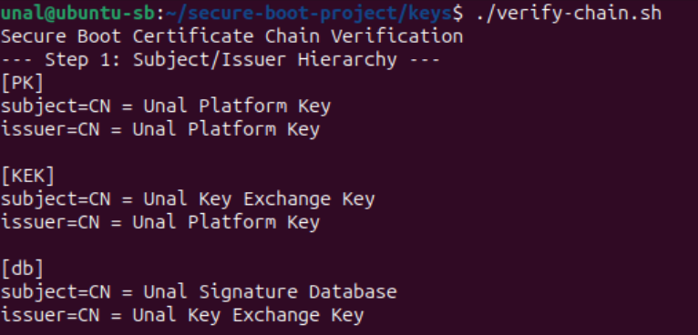

- **PK:** Subject = Issuer (`CN=Unal Platform Key`) → self-signed
- **KEK:** Subject = `CN=Unal Key Exchange Key`, Issuer = `CN=Unal Platform Key` → signed by PK
- **db:** Subject = `CN=Unal Signature Database`, Issuer = `CN=Unal Key Exchange Key` → signed by KEK

### Step 2: Negative test

The script also tries to verify db directly against PK (skipping KEK) — this chain **should fail**:

```bash
openssl verify -CAfile PK.crt -partial_chain db.crt
```

If the check is correctly rejected, that proves the verification is doing real work and not just rubber-stamping everything.

> **Script source:** [verify_chain.sh](scripts/verify_chain.sh) — I can re-run it any time to re-check the chain.

## References

- [UEFI Spec 2.10 — Secure Boot and Driver Signing](https://uefi.org/specs/UEFI/2.10/32_Secure_Boot_and_Driver_Signing.html)
- [James Bottomley — The Meaning of all the UEFI Keys](https://blog.hansenpartnership.com/the-meaning-of-all-the-uefi-keys/)
- [openssl-genrsa manual](https://docs.openssl.org/master/man1/openssl-genrsa/)
- [Claude AI (Anthropic)](https://claude.ai) — used as an interactive assistant for explanations, troubleshooting, and structuring this document