# Unified Kernel Image (UKI)

**Author:** Unal Külekci

> **Note on paths:** Examples use my project layout (`~/secure-boot-project/` for keys, `/boot/efi/EFI/Linux/my_ubuntu.efi` for the UKI). Adjust to your own paths when following along.

> This document continues from [efi_conversion.md](efi_conversion.md). At that point, GRUB and the kernel are signed with my `db.key`. But one file is still not signed: the **initramfs**. This is a known weakness in Secure Boot, and UKI is the modern fix.

## The Problem — "Initrd Gap"

When the system boots, each step verifies the next step. But the initramfs is loaded by the kernel and is **not signed**. An attacker with root access can change it and inject malicious code. The kernel does not notice, and Secure Boot does not catch this.

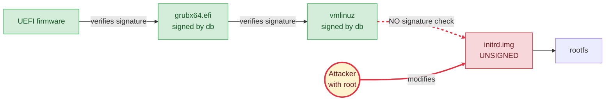

**Red arrows show the attack path.** The kernel trusts the initramfs without checking. If the attacker changes a script inside it, the malicious code runs at boot, before the real system starts. Secure Boot never sees this, because it only checks what UEFI loads.

## What is UKI?

A **Unified Kernel Image (UKI)** is one single `.efi` file that bundles everything the boot needs:

- The Linux kernel
- The initramfs
- The kernel command line
- The OS release info
- (optional) A boot logo

Because everything lives inside one file, **one signature covers all of them**. If someone changes the initramfs, the signature breaks and UEFI refuses to boot.

## How UKI Fixes the Problem

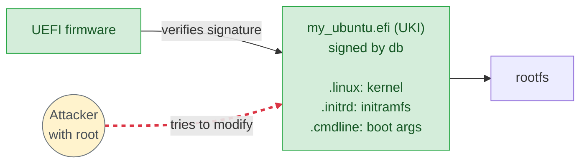

Now the attacker cannot change the initramfs without breaking the UKI signature. UEFI refuses to boot the tampered file. The "initrd gap" is closed.

## Installing Packages

`ukify` is the tool that builds UKIs. I install it via the `systemd-ukify` package.

Install the package:

```bash
sudo apt update
sudo apt install -y systemd-ukify
```

Then verify the installation:

```bash
which ukify
ukify --version
file /usr/bin/ukify
```

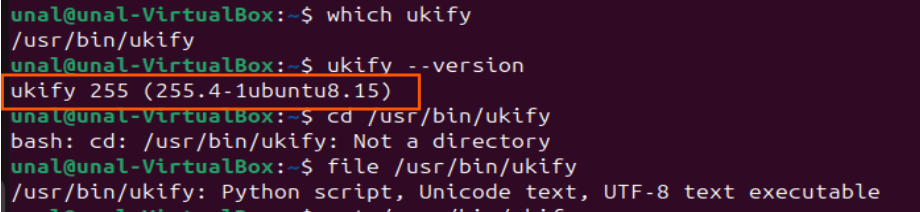

`ukify` is a Python script that packs all those pieces into a single `.efi` file.

### systemd-stub (`linuxx64.efi.stub`)

`ukify` also needs the stub EFI binary, `linuxx64.efi.stub`. Ubuntu ships this in a separate package:

```bash
sudo apt install -y systemd-boot-efi
ls -l /usr/lib/systemd/boot/efi/linuxx64.efi.stub
```

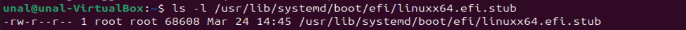

Why it matters:

- The stub is a small EFI program. UEFI runs it first when booting a UKI.
- At boot, it reads `.linux`, `.initrd`, and `.cmdline` from the same file, measures them into the TPM (PCR 11), and starts the kernel.
- `ukify` builds the UKI by copying this stub and adding my kernel and initramfs as sections, so the stub must exist on disk first.

## Building a Test UKI

> **Script:** [`scripts/build_uki.sh`](scripts/build_uki.sh) automates the build, sign, and ESP install steps below.

I build an unsigned UKI first to look at its structure. Then I sign it with my own `db.key` that I created earlier.

The inputs I pass to `ukify` (`--linux` and `--initrd` are required for our goal of closing the initrd gap; `--cmdline` and `--os-release` are recommended):

- **`--linux`** — the running kernel image, `/boot/vmlinuz-$(uname -r)`.
- **`--initrd`** — the matching initramfs, `/boot/initrd.img-$(uname -r)`.
- **`--cmdline`** — the kernel command line. I reuse `/proc/cmdline` and strip the `BOOT_IMAGE=...` entry, which GRUB adds automatically and is unnecessary inside a UKI.

  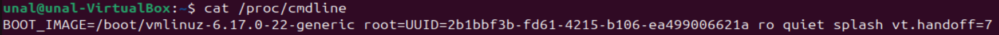

- **`--os-release`** — my distro identity, read from `/etc/os-release`. The `@` tells ukify to read the file content and embed it as the `.osrel` section.

Command:

```bash
sudo ukify build \
  --linux=/boot/vmlinuz-$(uname -r) \
  --initrd=/boot/initrd.img-$(uname -r) \
  --cmdline="$(cat /proc/cmdline | sed 's|BOOT_IMAGE=[^ ]* ||')" \
  --os-release=@/etc/os-release \
  --output=/tmp/test-uki.efi
```

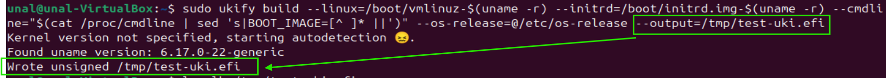

> **Alternative — build + sign in one step:** `ukify build` can sign during the build by passing `--secureboot-private-key`, `--secureboot-certificate`, and `--signtool=sbsign`. The separate `sbsign` step is not needed.
>
> ```bash
> sudo ukify build \
>   --linux=/boot/vmlinuz-$(uname -r) \
>   --initrd=/boot/initrd.img-$(uname -r) \
>   --cmdline="$(sed 's|BOOT_IMAGE=[^ ]* ||' /proc/cmdline)" \
>   --os-release=@/etc/os-release \
>   --secureboot-private-key=$HOME/secure-boot-project/keys/db.key \
>   --secureboot-certificate=$HOME/secure-boot-project/keys/db.crt \
>   --signtool=sbsign \
>   --output=/tmp/uki-signed.efi
> ```
>
> The two-step flow (build → sbsign) shown above keeps the structure visible; the one-step form is what a production hook would use.

Notes on the output:

- **Autodetection** — because I did not pass `--uname`, ukify inspects the kernel image and extracts the version string itself. It writes this into the `.uname` section.
- **"Wrote unsigned"** — the `.efi` file is a complete, valid UKI but carries no signature yet. UEFI with Secure Boot enabled will refuse to boot it. That is intentional — I will sign it with my `db.key` in the next step after verifying the structure.

I use `/tmp/` as the output path on purpose: it is a test artifact, not meant to replace `/boot/efi/EFI/Linux/`. If anything looks wrong I just delete it.


## Inside a UKI

A UKI is a normal PE/COFF binary (same format as Windows `.exe`). To see what actually ended up inside `/tmp/test-uki.efi`:

```bash
file /tmp/test-uki.efi
objdump -h /tmp/test-uki.efi
```

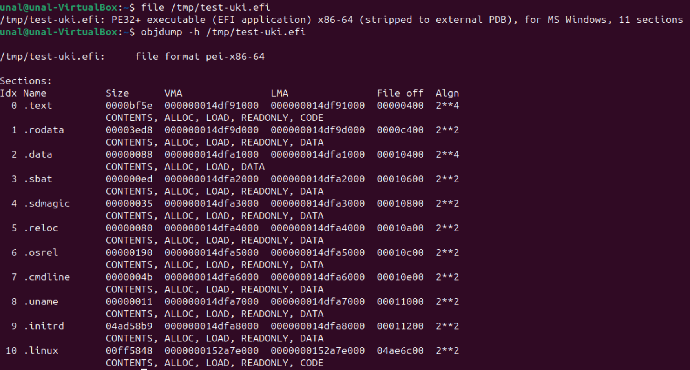

`file` reports `PE32+ executable (EFI application) x86-64 ... 11 sections`. Ukify produced a valid EFI binary. The 11 sections split into two groups.

### Stub sections (come from `linuxx64.efi.stub`)

These are part of the systemd-stub template and are required by the PE/COFF format. They are the machinery that runs at boot, not the payload.

| Section | Role |
|---|---|
| `.text` | Executable code of the stub. This is what UEFI jumps into first. |
| `.rodata` | Read-only data used by the stub code (strings, tables). |
| `.data` | Writable data used by the stub at runtime. |
| `.reloc` | PE relocation table. Standard part of any PE binary. |
| `.sdmagic` | A systemd-stub magic marker that identifies this file as a UKI. |

### Payload sections (ukify embedded them)

These are the parts that describe **my** system. They are the reason UKI exists — one signature covers all of them.

| Section | What it holds | My value |
|---|---|---|
| `.linux` | The kernel image (`vmlinuz`) | `6.17.0-22-generic`, ~16 MB |
| `.initrd` | The initramfs archive | ~78 MB, the biggest section |
| `.cmdline` | Kernel boot arguments | `root=UUID=... ro quiet splash vt.handoff=7` |
| `.osrel` | Copy of `/etc/os-release` | Ubuntu 24.04 identity |
| `.sbat` | Secure Boot Advanced Targeting (revocation metadata) | Prevents old, revoked stubs from booting |
| `.uname` | Kernel version string | `6.17.0-22-generic` |

A `.splash` section can also appear here if `--splash` is passed to `ukify`. I did not, so it is not in my UKI.

### Which sections matter for Secure Boot?

The security goal is to make the **whole** file tamper-evident. Once I sign the UKI, the signature covers every section above — stub and payload together. If an attacker flips a single byte in `.initrd`, the signature breaks and UEFI refuses to boot.

The sections I care about most when reviewing a UKI:

- **`.initrd`** — the actual "initrd gap": this was unsigned before UKI. Now it sits inside the signed perimeter.
- **`.linux`** — was already signed (Canonical or my `db.key`), but now travels under the same single UKI signature. Simpler trust chain.
- **`.cmdline`** — the attacker's easiest lever if left unsigned: flipping `ro` to `rw init=/bin/bash` used to give a root shell. Inside a UKI it cannot change without breaking the signature.
- **`.sbat`** — revocation. If a compromised stub is blacklisted in the future, `.sbat` is what makes revocation work.

`.text`, `.rodata`, `.data`, `.reloc`, `.sdmagic` are standard PE/stub plumbing — I do not configure them, but the signature covers them too.

## Signing the UKI

The unsigned UKI is a complete file but UEFI will reject it under Secure Boot. I sign it with my own `db.key` (created earlier) so UEFI can verify it.

### Sign with `sbsign`

```bash
sudo sbsign --key ~/secure-boot-project/keys/db.key \
            --cert ~/secure-boot-project/keys/db.crt \
            --output /tmp/uki-signed.efi \
            /tmp/test-uki.efi
```

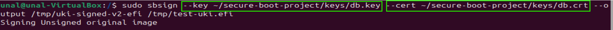

`sbsign` writes the signed result to a new file (`/tmp/uki-signed.efi`) instead of changing the original. This way the unsigned version stays for comparison.

### Verify the signature

```bash
sbverify --list /tmp/uki-signed.efi
sbverify --list /tmp/test-uki.efi
```

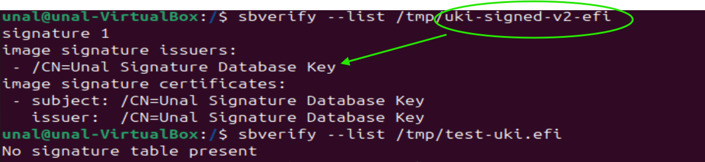

What I expect:

- Signed file → `signature 1` with `subject: /CN=Unal Signature Database` and `issuer: /CN=Unal Key Exchange Key` (db is signed by KEK).
- Unsigned file → `No signature table present`.

## Installing the Signed UKI

Now I move the signed file from `/tmp/` to its real home on the EFI System Partition (ESP), under `/boot/efi/EFI/Linux/`. systemd-boot looks here automatically and recognises any UKI it finds.

### Before — only the old `.conf` entry

Before I copy anything, the directory is empty and `bootctl list` shows only the original Type #1 entry:

```bash
ls /boot/efi/EFI/Linux/
bootctl list
```

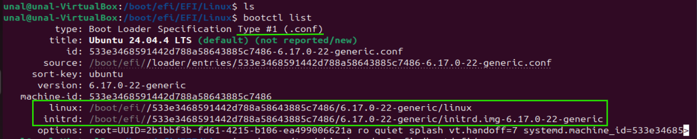

What this tells me:

- `/EFI/Linux/` is empty → no UKI yet.
- Only one entry: **Type #1 (.conf)**, the classic GRUB-style layout with separate `linux` and `initrd` files (the unsigned initramfs lives here — the "initrd gap").
- `options:` shows the cmdline as plain text inside the `.conf`, also unsigned.

### Copy to the ESP

```bash
sudo cp /tmp/uki-signed.efi /boot/efi/EFI/Linux/my_ubuntu.efi
```

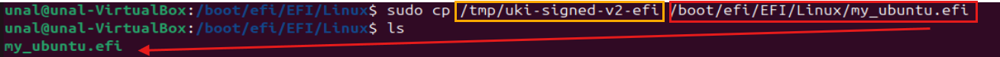

The filename `my_ubuntu.efi` is just a label — I picked it to make clear this UKI is signed with my own key. The path matters: `/EFI/Linux/` is the standard UKI location.

### After — the UKI shows up automatically

```bash
bootctl list
```

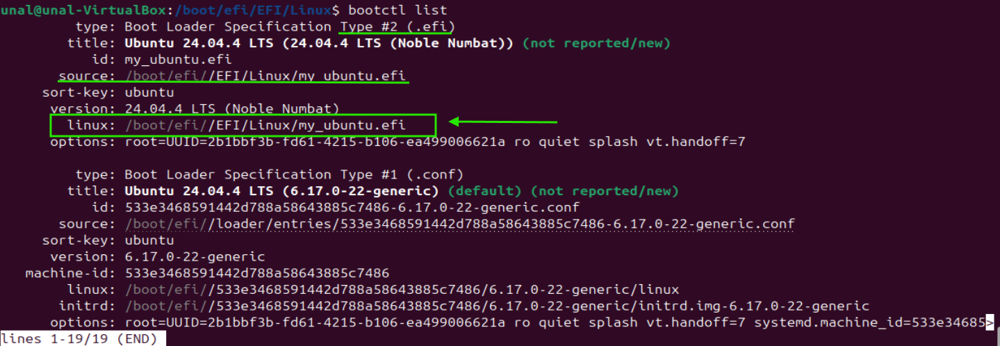

Now `bootctl list` shows two entries:

- **Type #2 (.efi)** — the new UKI. `source` and `linux` both point to the same `my_ubuntu.efi`, because the kernel is inside the UKI. There is no `initrd:` line — the initramfs is also inside. The cmdline comes from the signed `.cmdline` section, not from a `.conf` file.
- **Type #1 (.conf)** — the old entry stays as a fallback.

I did not write any configuration. systemd-boot found the file the moment it was placed under `/EFI/Linux/`. That is the whole point of Type #2: drop the file in, the loader picks it up.

### Add a UEFI boot entry

`bootctl list` showing the UKI does **not** mean UEFI will boot it. The two lists live in different places:

- **`bootctl list`** — what **systemd-boot** would offer in its menu, **if** systemd-boot is the loader UEFI runs.
- **`efibootmgr`** — what the **UEFI firmware itself** keeps in its own boot list (`BootOrder`, `Boot0001`, `Boot0002`, ...). This is the list UEFI consults at power-on.

In a typical Ubuntu install UEFI defaults to `shim → GRUB`, so it never hands control to systemd-boot.

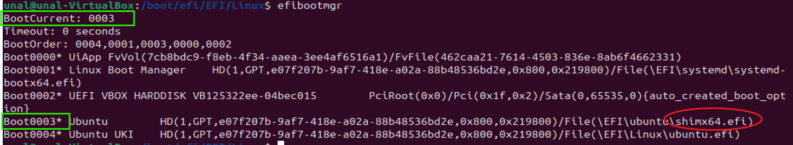

So I add a direct UEFI boot entry pointing at the UKI:

```bash
sudo efibootmgr --create --disk /dev/sda --part 1 --label "My Ubuntu UKI" --loader '\EFI\Linux\my_ubuntu.efi'
```

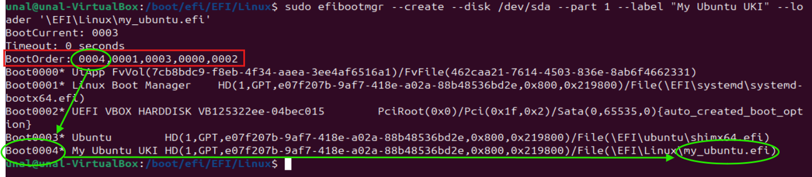

What this output shows:

- A new `Boot0004* My Ubuntu UKI` line, pointing to `\EFI\Linux\my_ubuntu.efi`.
- `BootOrder: 0004,0001,0003,0000,0002` — `efibootmgr --create` automatically put the new entry **first**. UEFI will try the UKI before any other boot option.
- `BootCurrent: 0003` — the system was booted from `Boot0003 (shim → GRUB)` because that is what is running right now. `BootCurrent` only updates after the next reboot. The gap between `BootOrder[0]` and `BootCurrent` is normal until I reboot — and on VirtualBox this gap will stay, because UEFI will reject the UKI signature and fall back through the order to `0003`.

The two layers in one picture:

```
UEFI firmware  --(BootOrder, efibootmgr)-->  picks one EFI program
                                                   |
                                                   v
                                     shim+GRUB | systemd-boot | UKI directly
                                                   |
                                                   v
                                              kernel + initramfs
```

`efibootmgr` writes to the top layer. `bootctl list` reads the middle layer. Both are needed for a UKI to actually boot.

### Cleaning up an old entry

Earlier in the project I had created a `Boot0004` pointing to a different file (`\EFI\Linux\ubuntu.efi`) and then later renamed the UKI to `my_ubuntu.efi`. Deleting the file from disk did **not** remove the boot entry — UEFI boot entries live in firmware NVRAM, not on the ESP. They are two different things:

| Item | Where it lives | What removes it |
|---|---|---|
| `ubuntu.efi` (the file) | Disk: `/boot/efi/EFI/Linux/` | `rm` |
| `Boot0004` (the entry) | UEFI firmware NVRAM | `efibootmgr -b 0004 -B` |

So when the file was gone but the entry was not, UEFI was still trying `\EFI\Linux\ubuntu.efi`, finding nothing, and silently falling through to the next entry. The cleanup:

```bash
# remove the dead file, if any
sudo rm /boot/efi/EFI/Linux/ubuntu.efi

# remove the stale boot entry
sudo efibootmgr -b 0004 -B

# add a fresh entry pointing at the current UKI
sudo efibootmgr --create --disk /dev/sda --part 1 --label "My Ubuntu UKI" --loader '\EFI\Linux\my_ubuntu.efi'
```

This is also a good reason to scan `efibootmgr` output once in a while: orphan entries from past installs and live-USB sessions accumulate over time.

## Key Reuse and Enrollment Prerequisite

I sign the UKI with the same `db.key` that I already use for GRUB and the kernel — one key, one trust chain, simpler to manage. For UEFI to actually accept the signed UKI, my `db.crt` must be enrolled in the firmware's `db` **before** the UKI is booted. If the certificate is missing from `db`, Secure Boot rejects the UKI no matter how cleanly it is signed.

In my VirtualBox test the certificate is not enrolled, so the UKI is rejected at boot and the system falls back to GRUB. The whole signing workflow still runs end-to-end; only the firmware-side trust check is missing, and that part needs real hardware.

## Suggested Next Step — Automation

Every kernel update produces a new initramfs, and the existing UKI becomes stale. `scripts/build_uki.sh` covers the manual rebuild flow. Full automation would be a small script in `/etc/kernel/postinst.d/` that runs the rebuild on each kernel install — see the Debian Wiki entry in *Sources* for the pattern.

## What UKI Solves and What It Does Not

UKI is one layer, not a full solution. It is important to be honest about what it actually closes and what it leaves open.

### What UKI gives me

- **Closes the initrd gap.** The initramfs used to be the only unsigned step in the boot chain. Now it lives inside the signed UKI; flipping a single byte breaks the signature.
- **Single signature covers everything.** Kernel, initramfs, cmdline, OS-release — one signing operation, one verification.
- **No `.conf` files to write.** systemd-boot recognises any `.efi` placed under `/EFI/Linux/`, so configuration drift becomes harder.
- **Tamper-evident cmdline.** The classic `ro` → `rw init=/bin/bash` GRUB attack no longer works — the cmdline is part of what the signature covers.

### What UKI costs

- **File size.** A UKI is kernel + initramfs in one binary, often 80–150 MB.
- **Cmdline changes need a rebuild.** Tweaking a kernel parameter is no longer a one-line edit; the UKI must be regenerated and re-signed.
- **Brick risk on automation failure.** If the post-update hook breaks, the next kernel update produces a UKI that does not boot. A working fallback entry is essential.
- **`db.key` still on disk.** Until the signing key is moved off the host (into a KMS or hardware token), a root attacker can sign their own UKI.

### Attacks UKI does NOT stop on its own

A common misreading is "I shipped a UKI, the initrd gap is gone." It is not — UKI alone leaves several routes open. The most important ones:

#### 1. Root attacker forges a fresh UKI

If `db.key` lives on disk (as it does here), a root-level attacker can read the key, build their own malicious UKI, sign it, and replace the legitimate file. UEFI accepts it because the signature is genuine. **The fix is to move the signing key off the host** — into a Key Management Service (KMS) or hardware token, so root alone is not enough to forge a signature.

#### 2. Boot-order hijack to the old chain

This is the subtle one. Even with a perfectly signed UKI in `/EFI/Linux/`, the system still has:

- `/boot/initrd.img-*` on disk, **unsigned**.
- `shim → GRUB → kernel → unsigned initramfs` boot path still installed and still trusted by `db` (because Microsoft and Canonical CAs are usually still there).

UEFI variables `BootOrder` and `Boot####` are **not authenticated**. A root attacker can run `efibootmgr -o ...` and put `shim → GRUB` first. Reboot. UEFI cheerfully boots the old chain. The attacker tampered with the unsigned initramfs beforehand, and the malicious code runs at boot.

The UKI signature is fine. The UKI just never gets called. **The initrd gap is reopened by going around the UKI, not by attacking it.**

#### 3. Downgrade to an older signed UKI

The attacker does not need `db.key`. They just keep an old UKI (signed by you weeks ago, with a kernel that has a known CVE) and replace the current `my_ubuntu.efi` with it. The signature is still valid — it was issued by you, after all. UEFI accepts the older, vulnerable image. Mitigated by SBAT version bumps and `dbx` revocation, both outside the scope of this guide.

#### 4. Firmware-level attack

Reflashing the SPI chip, a malicious UEFI module, or an Option ROM all sit **below** the UKI in the trust chain. Secure Boot itself can be reconfigured or disabled by an attacker who has physical access to the firmware. UKI cannot help here.

#### 5. Post-boot kernel exploit

UKI protects the boot chain. Once the kernel is running, a kernel-space exploit, container escape, or zero-day in a daemon is unaffected. UKI is a boot-time control, not a runtime one.

### Each attack needs its own answer

The attacks above are different in nature, so signing the UKI harder does not help. Each one is closed by a different control:

| Attack | What stops it |
|---|---|
| Forge a UKI with stolen `db.key` | Move the signing key off the host (network-bound key store, hardware token). |
| Boot-order hijack to the old chain | Restrict UEFI `db` to my own certificate only, so Microsoft- and Canonical-signed binaries are rejected. Optionally remove the old initramfs and GRUB files from the ESP entirely. |
| Downgrade to an older signed UKI | Bump SBAT entries on each release and use `dbx` revocation to ban older versions. |
| Firmware attack | Out of scope for the OS. Needs vendor firmware updates, signed firmware capsules, and physical security. |
| Post-boot kernel or service exploit | Runtime hardening — kernel lockdown, LSMs, seccomp, least privilege. UKI is a boot-time control. |

The "boot-order hijack" row is the one most people miss. UEFI variables `BootOrder` and `Boot####` are not authenticated, so a root attacker can rewrite them with `efibootmgr -o`. As long as the firmware still trusts a Canonical-signed shim and an unsigned initramfs is still on disk, the attacker simply walks around the UKI. Closing this requires tightening `db` and getting rid of the old fallback artefacts — not a stronger UKI.

### What this means in practice

- UKI is the right step after signing GRUB and the kernel. It removes the last unsigned piece of the path I deliberately designed.
- It does **not**, by itself, prevent an attacker from going around that path through the old, still-trusted chain.
- The complete picture needs four pieces working together: a UKI for the boot path, a `db` that contains only my cert (no Microsoft/Canonical fallback), TPM-bound disk unlock so the disk only opens through the UKI path, and a key store that keeps the signing key off the host. UKI is one of those four — necessary but not sufficient on its own.

## Sources

- [Unified Kernel Image specification (UAPI Group)](https://uapi-group.org/specifications/specs/unified_kernel_image/) — the UKI format spec.
- [Boot Loader Specification (UAPI Group)](https://uapi-group.org/specifications/specs/boot_loader_specification/) — defines the Type #1 and Type #2 entries shown by `bootctl list`.
- [systemd-stub(7)](https://www.freedesktop.org/software/systemd/man/latest/systemd-stub.html) — official reference for `linuxx64.efi.stub`: which sections it reads and how it measures into the TPM.
- [systemd-boot(7)](https://www.freedesktop.org/software/systemd/man/latest/systemd-boot.html) — how `/EFI/Linux/` is auto-discovered and listed as Type #2 entries.
- [ukify(1)](https://manpages.ubuntu.com/manpages/noble/man1/ukify.1.html) — full reference for the `ukify build` command and its flags.
- [sbsign(1)](https://manpages.ubuntu.com/manpages/noble/man1/sbsign.1.html) — UEFI binary signing tool used to sign the UKI.
- [efibootmgr(8)](https://manpages.ubuntu.com/manpages/noble/man8/efibootmgr.8.html) — managing UEFI `BootOrder` and boot entries.
- [Arch Wiki — Unified Kernel Image](https://wiki.archlinux.org/title/Unified_kernel_image) — practical build guide.
- [Debian Wiki — UKI](https://wiki.debian.org/UKI) — three build paths (`systemd-ukify`, `mkosi-initrd`, pre-built UKIs) and the standard `postinst.d` / `post-update.d` automation hook templates.
- [Claude AI (Anthropic)](https://claude.ai) — used as an interactive assistant for explanations, troubleshooting, and structuring this document.