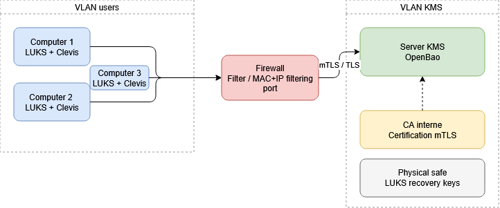

# 1. Background and objectives

## 1.1 Project background
This document describes the security architecture designed to ensure the protection of data stored on Linux workstations. The primary requirement is that no workstation should be able to boot without authenticating with a centralized key management service (KMS).

The solution is based on two complementary pillars:
- Disk encryption using LUKS (Linux Unified Key Setup)
- A centralized KMS that exclusively holds the decryption keys. Without a network connection to the KMS, the workstation is unable to mount its root filesystem.

## 1.2 Safety objective
- Data confidentiality: Any physical extraction from a disk is useless without access to the KMS.
- Centralized access control: A workstation can be revoked immediately via the KMS, making it inaccessible upon the next reboot.
- Traceability: Every decryption attempt is logged on the KMS side.
- Scalability: Adding new workstations follows a standardized process (enrollment).

# 2. KMS solution
OpenBao is an open-source community fork of HashiCorp Vault, maintained under the governance of the Linux Foundation (LF Edge). It retains all of Vault's features while remaining licensed under the MPL 2.0, with no commercial restrictions.

# 2.1 Integration with LUKS via Clevis
Clevis is the client-side component that acts as the bridge between OpenBao and LUKS. It is installed in the system's initramfs and automatically handles the retrieval of the decryption key at boot time.

# 3. Architecture

## 3.1 Overview
The architecture is based on a strict client-server topology. Client machines never store the LUKS key in plain text on disk. The key is transmitted exclusively by the KMS during boot, via a TLS-encrypted channel.

## 3.2 Deployed components
On the KMS server side:
- OpenBao Server: a service for managing keys, policies, and audits.
- Built-in Raft database: persistent storage of secrets.
- Server TLS certificate: issued by an internal CA or Let's Encrypt.

On the client side:
- LUKS: Root Volume Encryption 
- Clevis: a tool that stores the KMS access token in the LUKS metadata and retrieves the key at boot time.
- initramfs: contains Clevis and the network client for connecting to the KMS 

## 3.3 Networking and security
- Dedicated KMS VLAN: Client devices access the KMS over an isolated VLAN with no Internet access.
- Firewall: Only the KMS port is open from the user VLAN.
- MAC/IP filtering: Prevents unauthorized access.

# 4. Securing the KMS server

## 4.1 TLS Authentication
Every communication between a client device and the KMS is protected by TLS
- The KMS server has a certificate signed by the internal CA.
- Each client device has a unique client certificate issued during enrollment.
- When a post is revoked, its certificate is revoked, preventing any future authentication.

## 4.2 Key Management
- Key rotation: can be performed at any time via the KMS without requiring any action on the endpoints.

## 4.3 Auditing
- OpenBao audit log: every request is logged
- Alerts for repeated authentication failures

# 5. Process for enrolling a new computer
Enrollment is the process by which a blank device (or an existing unencrypted device) is integrated into the KMS infrastructure. 

## 5.1 Enrollment process
1. Blank post starts
2. The enrollment script generates a random LUKS key
3. The disk is encrypted with this key (cryptsetup luksFormat)
4. The key is sent and stored on the KMS
5. The KMS returns a token 
6. The initramfs is configured with the token (Clevis PIN OpenBao)
7. The local LUKS key is deleted, only the KMS holds it
8. Restart -> normal boot sequence

## 5.2 Certificate management
- Each device receives a unique certificate during enrollment, signed by the internal CA.
- The certificate's Common Name (CN) identifies the computer

# 6. Workstation startup process

## 6.1 Boot sequence
1. BIOS/UEFI boots
2. GRUB loads the kernel and initramfs
3. When initramfs runs, Clevis attempts a network request to the KMS
4. KMS accessible + authentication OK -> LUKS key returned
4. KMS unreachable or authentication denied -> STOP, workstation inaccessible
5. cryptsetup decrypts the LUKS volume using the key provided
6. Mounting the root filesystem

# 7. High Availability

# 7.1 KMS redundancy
The KMS is a single point of failure.

- One active OpenBao server + one standby server ready to take over manually.

# 7.2 Emergency procedure
In the event of an irreparable failure of the KMS, the workstations will no longer be able to boot up. A emergency plan must be established.

Option 1 local key:
- During enrollment, a LUKS recovery key is generated and stored in a physical safe.
- If the KMS fails, the administrator can manually enter this key during startup.
Option 2 KMS snapshot:
- Encrypted backups of the OpenBao state 
- Restoration is possible on a new server 

## Sources

- Security architecture basics:  https://www.future-processing.com/blog/security-architecture-101-understanding-the-basics/
- aws security architecture: https://aws.amazon.com/what-is/security-architecture/
- OpenBao vs Hashicorp: https://lalatenduswain.medium.com/openbao-vs-hashicorp-vault-the-secrets-management-showdown-every-devops-team-needs-to-read-in-2026-458ae0d9a408
- OpenBao documentation: https://openbao.org/docs/what-is-openbao/
- mTLS: https://www.cloudflare.com/learning/access-management/what-is-mutual-tls/
- OpenBao raft: https://openbao.org/docs/configuration/storage/raft/
- Claude ai: Initial thoughts on how the overall infrastructure could be designed