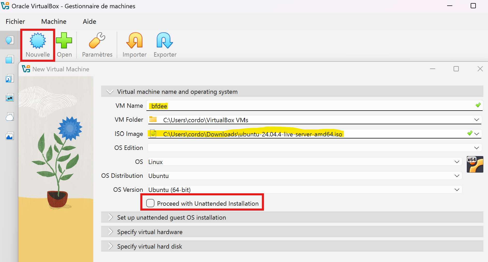
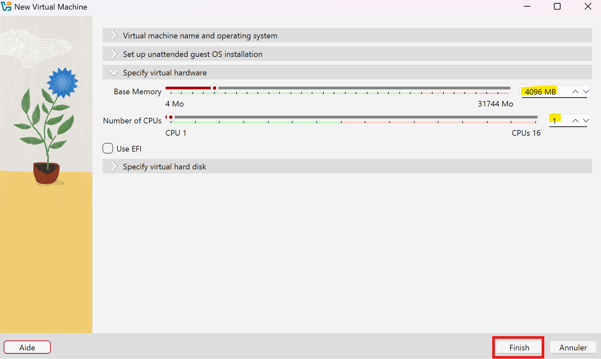
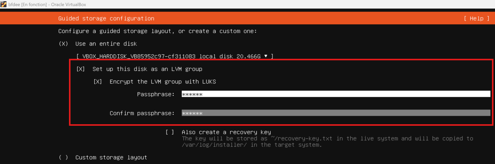
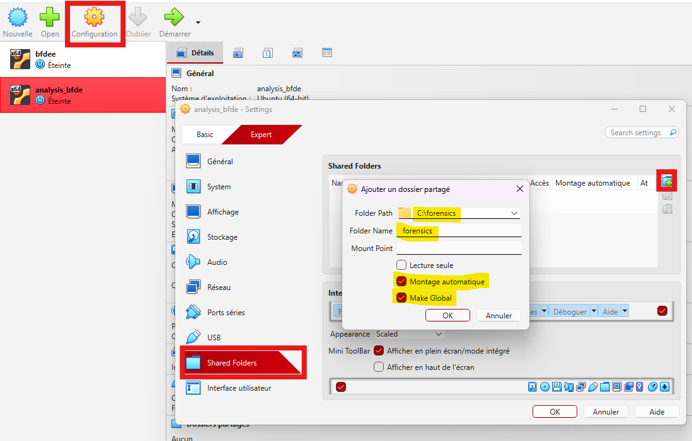

# Breaking Full Disk Encryption (FDE)
In this document, we will demonstrate how to forensically extract the master key from a live system in order to decrypt a LUKS volume without the user passphrase.

## 1. Install a Linux VM with LUKS (Full Disk Encryption)
For this part, you need to install VirtualBox and Ubuntu Server.
- Install Ubuntu Server: https://ubuntu.com/download/server
- Install Virtualbox: https://www.virtualbox.org/
Create new VM in Virtualbox:
- OS: Ubuntu Server or DEBIAN
- RAM: 2-4 GO

First, create your VM using VirtualBox



Specify virtual hardware and select "finish" when you're done 



During installation, enable Full Disk Encryption with LUKS.
- On Ubuntu Select "Set up this disk as an LVM group" and Encrypt the LVM group with LUKS

The installer automatically configures LUKS + AES on the entire disk.



## 2. Start VM and authenticate the user
1. Start VM, GRUB prompts fot the LUKS passphrase at boot time
2. Enter passphrase, the system decrypts and mounts the disk
3. At that precise moment, the AES master key is loaded into RAM.

## 3. Take a memory dump of the running VM
The goal is to capture the VM's RAM while it is running and the LUKS disk is mounted (meaning the master key is in memory). We work from the host machine, without touching the VM.

### 3.1 Check if vm is running and find out its exact name
1. Open external terminal
2. Go to the VirtualBox folder: 
```bash 
cd "C:\Program Files\Oracle\VirtualBox"

VBoxManage list runningvms

# You will get the name of your VM
# example:
"bfdee" {98839629-5a1e-430c-b99c-f45a8572989d}
```

### 3.2 Perform a memory dump
- ```bfdee```: The exact name of the VM
- ```\\wsl.localhost\Ubuntu\home\YourUser\memdump.elf```: The path where you want to save the dump
```bash
VBoxManage debugvm "bfdee" dumpvmcore --filename \\wsl.localhost\Ubuntu\home\YourUser\memdump.elf
# Your file must be similar size as your VM's memory
```

## 4. Scan dump with aeskeyfind
Install aeskeyfind and then you can run the analysis right away.
```bash
aeskeyfind memdump.elf¨
# You will see
01160d25cc99e97fb0afb35110efab7507364648d1f7fd77a216dd4981b046c4
6d5101005903b211313e9cf8270f2510f5ab3a53ae27dfe5c94825677ce9428b
cec9bbda260556eeeea345c7ebb691aebe1de3850bf9029a4d407608de6a5365
cec9bbda260556eeeea345c7ebb691aebe1de3850bf9029a4d407608de6a5365
000102030405060708090a0b0c0d0e0f101112131415161718191a1b1c1d1e1f
a0728bfdd01a98cacf8fdc3fe20b21be1d40161d1c1c602fe37df41c04aa6ae3
a0728bfdd01a98cacf8fdc3fe20b21be1d40161d1c1c602fe37df41c04aa6ae3
000102030405060708090a0b0c0d0e0f101112131415161718191a1b1c1d1e1f
f4c9209af40715c2b53ef8ea1fda174848a0719f61ec7e0a5f7b020d78bd4271
f4c9209af40715c2b53ef8ea1fda174848a0719f61ec7e0a5f7b020d78bd4271
000102030405060708090a0b0c0d0e0f101112131415161718191a1b1c1d1e1f
Keyfind progress: 100%
```
We can see that ```000102030405060708090a0b0c0d0e0f101112131415161718191a1b1c1d1e1f``` this key appears three times, it is a sequential test key (0, 1, 2, 3...) used by the system or cryptographic libraries for internal self-tests. We can ignore it.

All we have left are these keys, some appear twice, which means they are stored in multiple locations in our memory.
```
01160d25cc99e97fb0afb35110efab7507364648d1f7fd77a216dd4981b046c4
6d5101005903b211313e9cf8270f2510f5ab3a53ae27dfe5c94825677ce9428b
cec9bbda260556eeeea345c7ebb691aebe1de3850bf9029a4d407608de6a5365
a0728bfdd01a98cacf8fdc3fe20b21be1d40161d1c1c602fe37df41c04aa6ae3
f4c9209af40715c2b53ef8ea1fda174848a0719f61ec7e0a5f7b020d78bd4271
```
To find out which key is the right one, we can try them in the next step.

## 5. Mount the encrypted disk on a new VM
For this part, we will use another Ubuntu VM. The goal now is to mount the LUKS volume on a separate analysis machine using the master key directly, without ever knowing the user passphrase.

### 5.1 Analytics VM
For this part, I'm using a standard Ubuntu installation. https://ubuntu.com/download/desktop
```bash
# tools required on the VM
sudo apt install -y cryptsetup aeskeyfind lvm2 xxd
```

### 5.2 Set up shared folder between Windows and VM 2
For this part, I need to retrieve the disk from the other VM. Here’s one way to do it using VirtualBox.
The goal is therefore to transfer the disk and convert the .vdi file into a RAW image.
1. On windows create a shared folder (for example: ```C:\forensics```)
2. In VirtualBox with VM 2 turned off
    - Click on your VM 2 -> Configuration -> Shared Folders
    - File path: ```C:\forensics```
    - Share name: ```forensics```
    - Check "Automatic Installation" and "Permanent Access"



4. Restart the VM and install the guest additions
    - ```sudo apt install virtualbox-guest-utils virtualbox-guest-additions-iso```
5. Add your user to the group vboxsf to see the shared folder
    - ```sudo adduser $USER vboxsf```
6. Restart and you should see ```/media/sf_forensics```

### 5.3 Convert .vdi file to a RAW image (from windows)
Before working on the disc, you need to convert it on your computer.
```bash
cd "C:\Program Files\Oracle\VirtualBox"

# VM is your Ubuntu Server
.\VBoxManage.exe clonehd "C:\Users\YourUser\VirtualBox VMs\VM\VM.vdi" "C:\forensics\disc.img" --format RAW
```

### 5.4 Copy the files to VM 2
It's better to work on local copies.
```bash
# Create work file
mkdir ~/analysis 
# Copy the files from the shared folder
cp /media/sf_forensics/disc.img ~/analysis/
# Check to see if the copy worked
ls -lh ~/analysis/
```

### 5.5 Identify LUKS partition


#### Sources
- Official documentation about FDE: https://documentation.ubuntu.com/security/security-features/storage/encryption-full-disk/
- Install Ubuntu with LUKS Encryption: https://gist.github.com/superjamie/d56d8bc3c9261ad603194726e3fef50f
- Memory dump: https://cylab.be/blog/99/dump-the-memory-of-a-virtualbox-vm-for-volatility3?accept-cookies=1
- Understanding AESKeyFind: https://www.siberoloji.com/aeskeyfind-kali-linux-advanced-memory-forensics-aes-key-recovery/
- cryptsetup: https://man7.org/linux/man-pages/man8/cryptsetup.8.html
- quick and dirty linux forensics: https://clo.ng/blog/quick_and_dirty_linux_forensics/
- Cracking LUKS/dm-crypt passphrases: https://diverto.github.io/2019/11/18/Cracking-LUKS-passphrases
 

