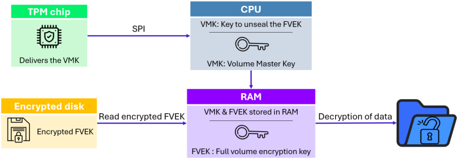

# BitLocker
***By Filip Siliwoniuk - 305.2 : Cybersecurity***

BitLocker is a full disk encryption feature included with Microsoft Windows since Windows Vista. It is designed to protect data by providing encryption for entire volumes.

By default, it uses **A**dvanced **E**ncryption **S**tandard (AES) encryption in [**C**ipher **B**lock **C**haining (CBC)](bitlocker_encryption.md#cipher-block-chaining) or [**X**or-Encrypt-Xor (XEX)-based **T**weaked codebook](bitlocker_encryption.md#xex-based-tweaked-codebook-mode-with-ciphertext-stealing) mode with [ciphertext **S**tealing](bitlocker_encryption.md#ciphertext-stealing) (XTS) mode with a 128-bit or 256-bit key. CBC is not used over the whole disk, it is applied to each individual sector.

## Availability
It is available on Windows Pro, Enterprise (Windows Vista - ) and Education editions (Windows 10 and Windows 11).
It works with Trusted Platform Module (TPM). BitLocker can validate integrity of boot and system files before decrypting a protected volume.

## Device encryption
The recovery key is stored in the Microsoft Account or in the Active Directory (Windows Pro is needed).
While encryption is offered on all editions of Windows 8.1, device encryption requires that the device meet the InstantGo specifications, which means having a SSD and a TPM 2.0 chip.

With Windows 11 24H2, BitLocker was automatically enabled.

## Encryption modes
Three authentification mechanisms can be used as building blocks to implement BitLocker encryption.

- **Transparent operation mode**: The key used for disk encryption is sealed (encrypted) by the TPM chip and will only be released to the OS loader code if the early boot files appear to be unmodified. The pre-OS components of BitLocker achieve this by implementing a Static Root of Trust for Measurement. This mode is vulnerable to cold boot attack. It is as well vulnerable to a sniffing attack, because the key is passed as plaintext between the TPM and the CPU.
- **User authentication mode**: This mode requires user's authentication to the pre-boot environment in the form of a pre-boot PIN or password.
- **USB Key mode**: The user has to insert a USB device that contains a startup key into the computer to be able to boot the protected operating system.

## Operation
At least two NTFS-formatted partitions are required, one for the operating system and another with a minimum size of 100 MB, which remains unencrypted and boots the operating system.

Once an alternate boot partition is created, the TPM is initialized, and the disk encryption key is then secured using protection mechanisms such as the TPM.

The volume is then encrypted as a background task. The keys are only protected after the whole volume has been encrypted.

It uses a low-level device driver to encrypt and decrypt all file operations.

## Key hierarchy
BitLocker contains multiple keys to encrypt a disk.

- **Full Volume Encryption Key (FVEK)**: The key used to encrypt/decrypt the disk. It is stored on encrypted disk by the VMK.
- **Volume Master Key (VMK)**: The key used to encrypt the FVEK. The VMK is protected by the TPM, PIN or Recovery Key.
- **Recovery Key**: A 48-digit numerical password that can be used to unlock the encrypted drive if the user has changed the hardware or if there is a problem with the TPM.

## Vulnerabilities
During the boot process, the TPM unseals the decryption key and sends it to the CPU in plaintext.

This allows for an attacker with physical access to the machine to sniff the key and decrypt the disk.
To do it, the attacker can use a Raspberry Pi Pico with a custom firmware to sniff the key directly from the motherboard.

## Sources
- [BitLocker - Wikipedia](https://en.wikipedia.org/wiki/BitLocker)
- [Breaking Bitlocker - Bypassing the Windows Disk Encryption](https://www.youtube.com/watch?v=wTl4vEednkQ)
- [BitLocker Overview: Understanding Today’s Threats](https://www.riskinsight-wavestone.com/en/2026/02/bitlocker-overview-understanding-todays-threats/)