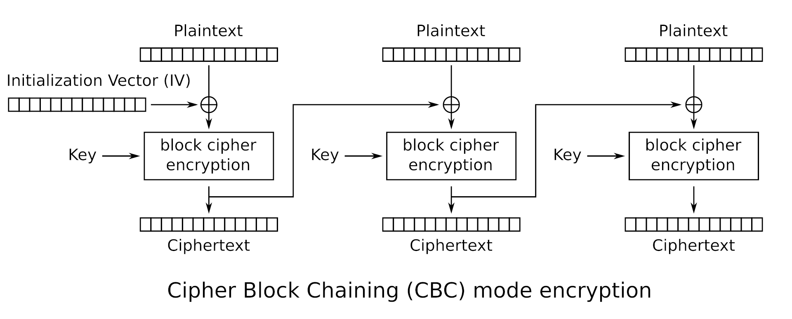
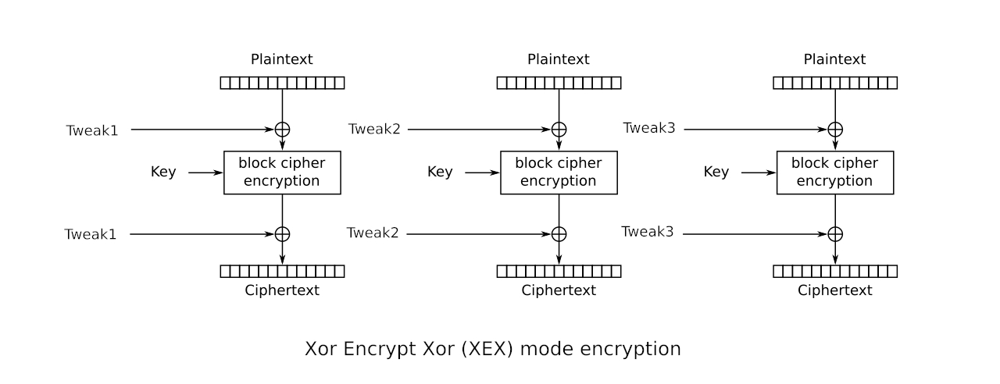
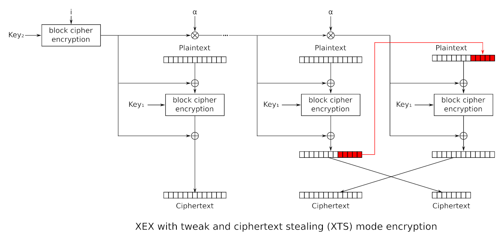

# BitLocker Encryption functions
***By Filip Siliwoniuk - 305.2 : Cybersecurity***

## Cipher Block Chaining
**I**nialization **V**ector (IV) is the first block which is used as the "previous" one for the real data first block. It is a random value which is generated for each encryption session.

This IV is used to XOR $\oplus$ the first block of plaintext $P_1$.

$$C_{temp} = P_1 \oplus IV$$

Then, $C_{temp}$ is encrypted with a key, generally a 128-bit or 256-bit AES key.

$$C_1 = E_K(C_{temp})$$

This $C_1$ is then used with the second block of plaintext $P_2$ and encrypted.

$$C_2 = E_K(P_2 \oplus C_1)$$

And so on for the rest of the blocks, which makes at the end a chain of blocks with:

$$C_i = E_K(P_i \oplus C_{i-1})$$



## Ciphertext Stealing
Ciphertext stealing is a technique for encrypting plaintext using a block cipher, without adding padding to the message to a multiple of the block size, so at the end the size of the ciphertext is the same as the size of the plaintext.

We have a plaintext of 20 bytes as the last block and a block size of 16 bytes.

### Split of the plaintext into blocks

**Message**: ENCRYPT THIS MESSAGE
- **Block 1** ($P_1$): `ENCRYPT THIS MES`.
- **Block 2** ($P_2$): `SAGE`.

### Encryption of the second-to-last block

It starts with an encryption of $P_1$ to $C_{temp}$

$C_{temp}$
```
4A 2B 9C 1D | 5E 3F 8A 0B 7C 6D 5E 4F 3A 2B 1C 0D
```

### Steal of last bytes of the second-to-last ciphertext

Then, we take the $P_2$ and concatenate it with last 12 bytes of $C_{temp}$ which will be $P_{temp}$.

$P_{temp}$
```
SAGE | 5E 3F 8A 0B 7C 6D 5E 4F 3A 2B 1C 0D
```

### Encrypting the $P_{temp}$ block

Then, we encrypt the $P_{temp}$ block the same way [CBC](#cipher-block-chaining) was explained, which means:

$$C_{final} = E_K(P_{temp} \oplus C_{i-1})$$

$C_{final}$
```
FF EE DD CC BB AA 99 88 77 66 55 44 33 22 11 00
```

### Final output
The receiver gets the 16-byte [$C_{final}$](#encrypting-the--block) block and first 4-byte from [$C_{temp}$](#encryption-of-the-second-to-last-block) block which has to be decrypted.

1. The receiver decrypts the 16-byte block.

    $D_k(C_{final}) \oplus C_{i-1} =$
    ```
    SAGE | 5E 3F 8A 0B 7C 6D 5E 4F 3A 2B 1C 0D
    ```


2. The tail of that decryption will reveal the **stolen bytes**.

    ```
    5E 3F 8A 0B 7C 6D 5E 4F 3A 2B 1C 0D
    ```

3. The receiver can reconstruct the first block's ciphertext [$C_{temp}$](#encryption-of-the-second-to-last-block)

    ```
    4A 2B 9C 1D | 5E 3F 8A 0B 7C 6D 5E 4F 3A 2B 1C 0D
    ```

4. The receiver can decrypt the first block and add the second block together to have the plaintext.

    $P_1 = D_K(C_{temp})\oplus IV =$
    ```
    ENCR | YPT THIS MES
    ```

5. The receiver can concatenate $P_1$ and $P_2$ to have the complete message.

    ```
    ENCRYPT THIS MESSAGE
    ```

## Xor-encrypt-xor
XEX is a method to transform a standard block cipher into a tweakable block cipher. It was used before XTS.

Instead of just encrypting the plaintext $P$ with key $K$, XEX XOR it with a value $T$ called a tweak.

$$C=E_k(P \oplus T) \oplus T$$

Where:

- $P$ is the plaintext block.
- $T$ is the tweak value, which is derived from the block's address/index.
- $E_k$ is the encryption function using key $K$.
- $C$ is the resulting ciphertext block.

### Tweak calculation
1. A `starting tweak` is generated by encrypting the logical position (sector number $i$) with the key.

    $X=E_k(i)$
2. For each subsequent block $j$ in the sector, the tweak is updated by a shift using a primitive element $\alpha$.

    $T = X \otimes \alpha^j$



## XEX-based tweaked codebook mode with ciphertext stealing
XTS is the modern standard for disk encryption. It solves the major problem of CBC, all blocks in XTS are impendent where CBC is based on the block before.

XTS standard requires using a different key for the IV encryption than for the block encryption, this differs from XEX which uses only a single key.

It uses **Key 1** for the block encryption/decryption and **Key 2** for tweak encryption.



## Sources
- [Disk encryption theory - Wikipedia](https://en.wikipedia.org/wiki/Disk_encryption_theory#XTS)
- [Ciphertext stealing - Wikipedia](https://en.wikipedia.org/wiki/Ciphertext_stealing)
- [CBC Encryption with Ciphertext Stealing - YouTube](https://www.youtube.com/watch?v=PkSWFahIRzw)
- [XEX image](https://en.wikipedia.org/wiki/Xor%E2%80%93encrypt%E2%80%93xor#/media/File:Xor_Encrypt_Xor_(XEX)_mode_encryption.svg)
- [Gemini, used for an example of Ciphertext Stealing](https://gemini.google.com)