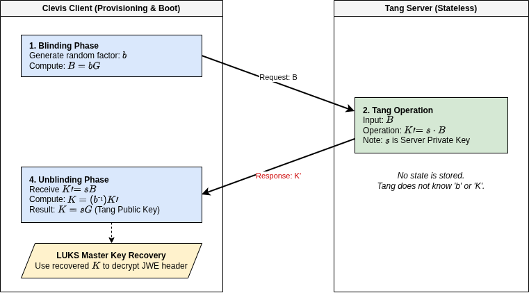
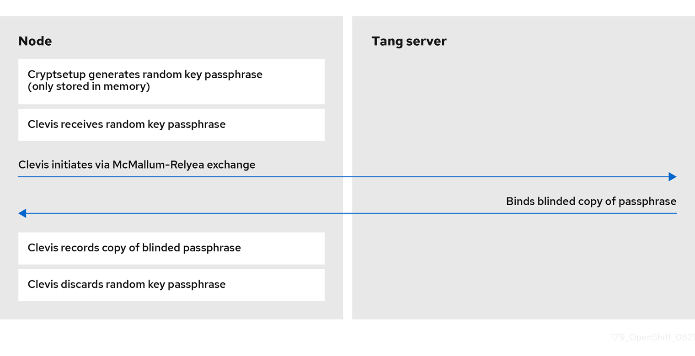
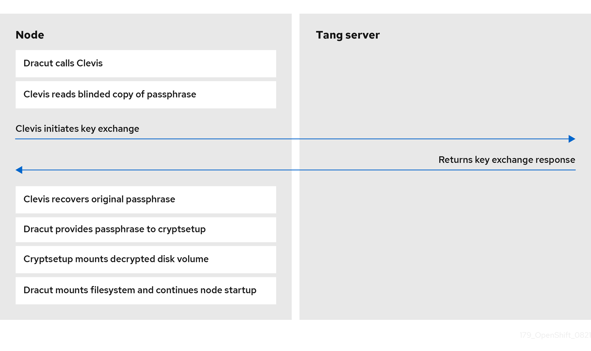
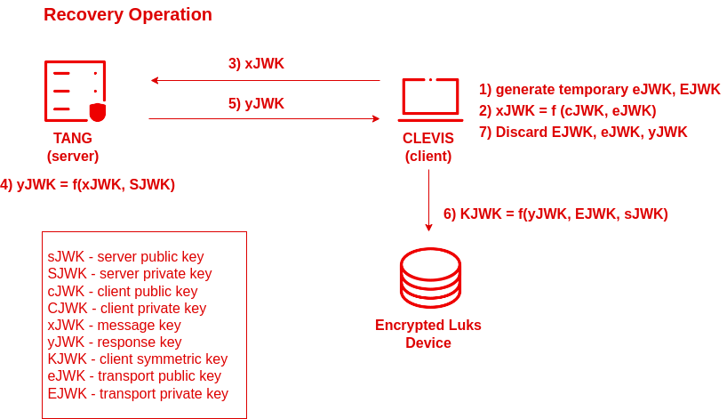

# Tang 

Tang is software that runs on a server that let's Clevis get keys through JSON over HTTP.

Tang performs 2 steps:

**Provisioning**: When we bind the device to the Tang server using Clevis.

<!--  -->

**Recovery**: Every time the device boots.

## McCallum-Relyea

McCallum-Relyea key exchange is an alternative method to [key escrow](https://en.wikipedia.org/wiki/Key_escrow) that allows the regeneration of a decryption key without requiring its retrieval. This algorithm is an advanced version of the Diffie-Hellman key exchange algorithm.

## Elliptic-curve Diffie–Hellman (ECDH)

ECDH is used whenever you need to create a secure "tunnel" between two points quickly and efficiently. It powers HTTPS, private messaging apps, SSH, and automated disk unlocking.

## Vulnerabilities

### Lack of Authentication

The McCallum-Relyea exchange is designed to be anonymous. The Tang server does not authenticate the Clevis client; it simply performs a mathematical operation on whatever the client sends.

**The Vulnerability**: Since the server doesn't know who it is talking to, anyone with network access to the Tang server and possession of the encrypted metadata (the JWE file stored on the disk) can attempt to recover the key.

**The Mitigation**: Security relies entirely on network segmentation. If an attacker gains physical possession of the disk and can also reach the Tang server via the network, they can unlock the data. This is why NBDE is typically used only on internal, firewalled LANs.

### Metadata Exposure

To perform the unlock, the client (Clevis) must store a "header" (JWE) on the disk that contains the public key ($a = g^A$) and the encrypted secret.

**The Vulnerability**: If the server's private key is ever compromised, any attacker who has collected these JWE headers from various machines can decrypt all of them offline.

**The Mitigation**: By periodically rotating the Tang server's keys and re-keying the clients, you limit the "blast radius" of a potential server-side key compromise.

# Sources

- [Chapter 14. Network-Bound Disk Encryption (NBDE)](https://docs.redhat.com/en/documentation/openshift_container_platform/4.9/html/security_and_compliance/network-bound-disk-encryption-nbde)
- [NBDE (Network-Bound Disk Encryption) Technology](https://access.redhat.com/articles/6987053)
- [Tang - GitHub](https://github.com/latchset/tang)
- [Elliptic-curve Diffie–Hellman](https://en.wikipedia.org/wiki/Elliptic-curve_Diffie%E2%80%93Hellman)