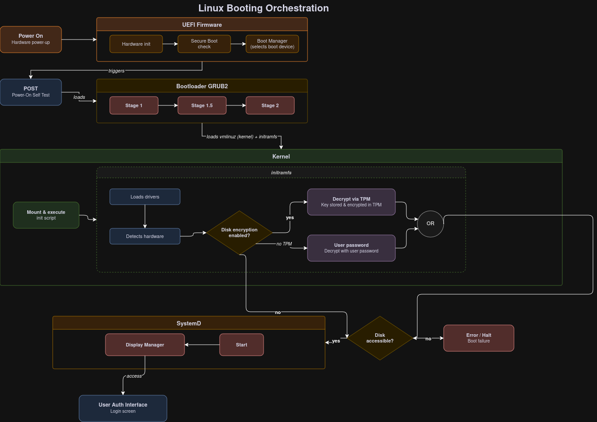

# How does Linux Booting works ? : Steps and details
***By Kevin Voisin - 305.2 : Cybersecurity***

## 1. Power-On
The user trigger manually the hardware power-on button on the computer , it then triggers the Firmware.

## 2. UEFI Firmware (BIOS)
The firmware is the very first program that is executed once the system is switched on.
It's a small piece of code stored on the motherboard.
It initialize hardware, if secure boot activated:
  - It verifies his signature with the Database of allowed certificates stored in the NVRAM.
  - If a component is not signed or his signature is invalid, the firmware interupt instantly the processus.
Then it triggers the BIOS POST then it loads the bootmanager who read and show the users all the booloaders available.

### 2.1 BIOS POST (Power-on-self-test)
This is the hardware phase, it ensures and verifies that the main hardware components like CPU,RAM,storage runs and works then it searches for a boot sector on the connected disks.
Then it loads up the first step of the bootloader and loads up his code.

## 3. The Bootloader : GRUB2
The load up of the Bootloader is too voluminous to be loaded on the first disk sector.
Therefore it is separated in 3 sub-steps.
Current and newest Linux OS use bootloader **GRUB2**.

### 3.1 Stage 1
A small code of 446 octets located on the MBR (Master Boot Record) is loaded, his role is to locate and load the stape 1.5.

### 3.2 Stage 1.5
Located in the dead empty space just after the MBR, it contains the necessary drivers to read the filesystem (EXT4,FAT,etc..), it allows the bootloader to understand the disk for then to go look for the root file.

### 3.3 Stage 2
This is the interactive part of the booloader.
It shows to the user the selection menu of kernel and loads in the RAM two crucials files :
- The kernel (vmlinuz) 
- The initial RAM Disk (initramfs)

***At this stage, the bootloader only loads these files into memory and then transfers control to the kernel.***

## 4. The Kernel 

### 4.1 The kernel (vmlinuz)

The kernel is the core of the operating system.

Once executed, it:

- Manages CPU, memory, and processes
- Handles hardware communication (via drivers)
- Provides system calls to user programs

Initially, the kernel is compressed and gets decompressed in memory during boot.

### 4.2 The initial RAM disk (initramfs)

A temporary root filesystem loaded into RAM.
Contains:
- Essential drivers (kernel modules)
- Minimal tools and scripts

Its role is to prepare the system before the real root filesystem is available.

### 4.3 The kernel initialization

After the bootloader(GRUB2) transfers control:

1. The kernel starts executing
2. It decompresses itself
3. It mounts initramfs as the temporary root filesystem
4. It executes the /init script inside initramfs

### 4.4 Early Userspace (inside initramfs)

At this stage:

- Required drivers are loaded (disk, filesystem, etc.)
- Hardware is detected
- At this stage, if disk encryption is enabled (e.g. LUKS), the system unlocks the disk:
  - Either by asking the user's passphrase.
  - Or automatically using TPM 2.0, which securely releases the decryption key only if the system boot state is trusted

The goal is to make the real root filesystem accessible.

Once the disk is accessible, the kernel start the first system processus : ***systemd***.

## 5. Startup with ***systemd***
The startup process follows the boot process and brings the Linux computer up to an operational state in which it is usable for productive work.

***systemd** is the mother of all processes and its responsible for bringing the Linux host up to a state in which productive work can be done.

sysinit.target: 
- Responsible for mounting filesystems,enable the swap and setup cryptographic services

basic.target:
- Initialize basic functions like timers,communications sockets,etc...

multi-user.target:
- It activate the console/terminal mode

graphical.target:
- Start the display manager for the GUI

# Diagram

# Our use case
We need to activate disk encryption in the boot loading,and find a way to generate our custom disks decrpytion/encryption key that will be encrypted by the TPM secret key.
We need to find a way to do it automatically :
    - If the disk encryption is not activate , activate and generate the key and encrypt in a background task (will the computer is on) all the disk content and the swap, theses data will be decrypted on the fly with the decrypt key stored in the RAM (will the computer is on then is ereased)

# Sources
- [Linux boot and startup](https://opensource.com/article/17/2/linux-boot-and-startup)
- [Arch boot process](https://wiki.archlinux.org/title/Arch_boot_process)
- [Linux illustrated](https://awwkl.github.io/linux_illustrated/boot/boot_UEFI.html#additional-info)
- [Claude](Claude.ai) : to enhance the initial made-by-hand digram <a href="data/initial_schema.jpg">initial-diagramm</a>
