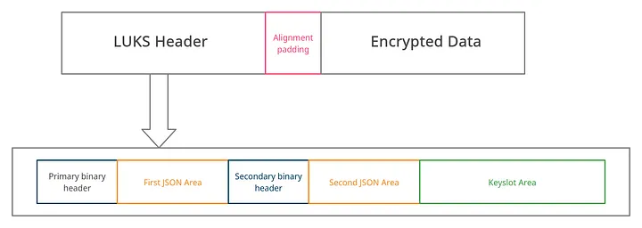

# LUKS Encryption
***By Kevin Voisin - 305.2 : Cybersecurity***

## 1. LUKS 
LUKS who stands for 'Linux Unified Key Setup' is the standard involved in the Linux Kernel for the disk encryption.
It allows to encrypt the entire disk, it supports multiple password/passphrase so that multiple users can access the same disk without sharing their password.

### 1.1 What is it ?
It provides a generic key store on the dedicated area on a disk, with the ability to use multiple passphrases to unlock a stored key.LUKS(LUKS2) has a more flexible way of storing metada.

### 1.1.1 LUKS Header

LUKS header provides metada for encryption setup. The followings are some of the features:

- Checksum mechanism to detect corruption and manipulation in header
- Metadata area is stored in two copies for a possible recovery
- Metadata are stored in JSON format. It allows future extensions without modifying binary structures
- Header contains objects called token, which contains information to where to get the unlocking passphrase

#### **JSON Area**

The JSON Area starts after the binary header and the end must be aligned to 4096-byte sector offset, so JSON area size is

'JSON_Area_size = header_size - 4096'

So the offset where the second binary header starts (reported in the table above) now makes sense: JSON size + bin_header_size (4096 byte) must match with the Offset. The unused space is filled with zeros.

#### **KeySlot Area**
Keyslot area is space on disk that can be allocated for binary data from keyslots, in fact there are stored encrypted keys referenced from keyslot metadata.

The allocated area is defined in a keyslot by an area object that contains offset (from the device beginning) and size fields, both fields must be validated otherwise will be rejected.

#### **Alignment padding**

The alignment padding has the purpose to align the encrypted data at the beginning of a block (block are encrypted one by one, typically a block is 512 byte) with the right offset to make LUKS properly work with the encrypted sectors.

#### **Metadata**
LUKS metadata allows defining object with a specific functionality. Objects not recognized are ignored, but still maintained into JSON metadata.

The implementation must validate the JSON structure before updating the on-disk header.

LUKS has some mandatory objects as follow:

- config — which contains persistent header configuration attributes
- keyslots — that are objects that describe encrypted keys storage areas
- digests — used to verify that decrypted keys are correct
- segments — describe areas on disk that contain user encrypted data
- tokens — can optionally include additional metadata, bindings to other systems

The following is a drill-down of the mandatory objects in LUKS metadata:

**Config object** :

The config object contains these fields, that are global for the LUKS device:

- json_size — JSON area size (in bytes), this fields must be equal to the binary header
- keyslots_size — binary keyslot area size (in bytes), this must be aligned to 4096 bytes
- flags — array of string objects with persistent flags for the device
- requirements — array of string objects with additional required features for the LUKS device

**Keyslot object**:
Keyslot objects contain information about stored keys, areas, where binary keyslot are stored, encryption type, anti-forensic function used, password-based key derivation function and related parameters.

*Each keyslot object contains*:

- type — keyslot type
- key_size — key size (in bytes) stored in keyslot
- area — allocated area in binary keyslot area
- kdf — PBKDF
- af — anti-forensic. Not in use in modern systems (LUKS2)
- priority — is the keyslot priority: 0 = ignore, 1 = normal, 2 = high.

**Digest object**:

To verify that a decrypted key (from a keyslot) is correct, LUKS uses digests object. These objects are assigned to keyslots and segments, if not assigned to a segment the digest is used for a unbound key.

Digest object contains these fields:

- type — digest type
- keyslots — array of keyslot objects names assigned to the digest
- segments — array of segment objects names assigned to the digest
- salt — binary salt for the digest
- digest — binary digest data

**Segment object**:

Segment object contains the definition for encrypted areas on the disk. For a normal LUKS device there is only one data segment present.

These are the fields:

- type — segment type (only crypt is currently used)
- offset — offset from the device start to the beginning of the segment
- size — segment size (in bytes) or dynamic (for the dynamic resize of the device)
- iv_tweak — starting offset for the Initializaion Vector
- encryption — segment encryption algorithm in dm-crypt notation
- sector_size — sector size for the segment (512, 1024, 2048 or 4096 bytes)
- integrity — LUKS2 user data integrity protection
- flags — array of string objects with additional information for the segment

**Token object**:

Token object is an object that describe how to get a passphrase to unlock a particular keyslot, and can contain additional JSON metadata.
These are the mandatory fields:

- type — defines the token type
- keyslots — array of keyslot objects names assigned to the token

### 1.2 How does it works ?

LUKS employs a two-tier encryption architecture:

1. Master Key

- Strong random key that encrypts the actual data
- Never directly exposed to users
- Stored encrypted in the LUKS header

2. Key Slots (User Keys)

- User-provided passphrases or keyfiles
- Encrypt the master key
- Up to 8 slots allow multiple users/keys
- Each slot can be independently managed

Encryption Process:

- User provides passphrase/keyfile
- LUKS derives key encryption key (KEK) from passphrase using [PBKDF2](https://fr.wikipedia.org/wiki/PBKDF2)
- KEK decrypts the master key from key slot
- Master key decrypts/encrypts actual disk data
- All operations happen transparently via dm-crypt

# Sources

- https://infosecwriteups.com/how-luks-works-with-full-disk-encryption-in-linux-6452ad1a42e8
- https://fr.wikipedia.org/wiki/LUKS
- https://cubepath.com/docs/server-security/disk-encryption-with-luks
