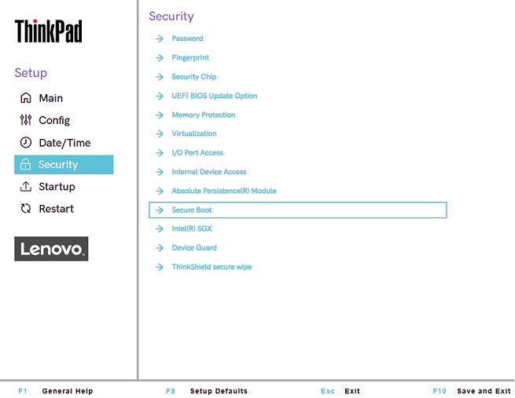
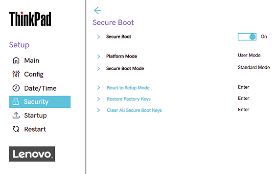
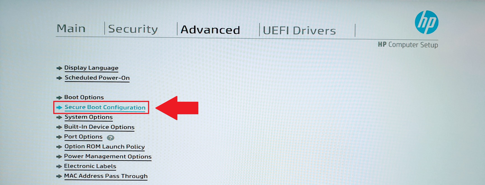
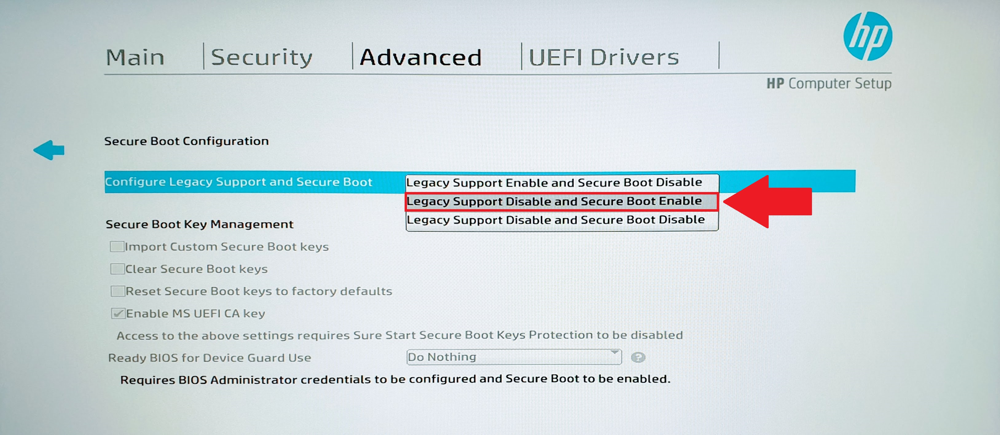

# Secure Boot
Secure boot is a security feature to ensure that a device boots using only software that is trusted by the **Original Equipement Manufacturer** (OEM). It supports modern Windows, Linux, etc.

Secure boot initiates a boot sequence process that checks and verifies that only authorized executable files run on the PC.

## Advantages of Secure Boot
- It eliminates the execution of malicious data on our system. It ensures that only authenticated and unaltered components are loaded during the boot process to main system's integrity.
- It prevents unauthorized modification to the boot process.
- Secure boot adds a security layer to remote or cloud-based management.

## Disadvantages of Secure Boot
- Restricts users from intalling alternative operating systems.
- Blocks a software if its signature is not matched or invalid.
- It can be exploited through vulnerabilities in the firmware, hardware.
- It increases the complexity of the boot process.

## Boot sequence
The secure boot functionality follows a list of events on any computer.

1. **Initialization of UEFI Firmware**

    UEFI must be enabled in the BIOS settings to start the process.
    The boot sequence begins with the UEFI firmware activation before the POST hardware check.

2. **Verification of Firmware Integrity**

    The UEFI firmware will do a self-integrity check using the Plaftorm KEY (PK), the highest-level cryptographic key in the UEFI hierarchy, to establish a root of trust for the boot process. 

    The PK is used to control who is allowed to update the security settings of the firmware. Without the PK, it won't be possible to modify the list of "trusted" software to run on the computer. It establishes a relationship between the hardware manufacturer and the machine.

3. **Signature checking**

    The boot sequence check the digital signature of the Bootloader and executable files againt a database of trusted signatures.

    The self-integrity checks if any modification of the UEFI firmware exist to avoid modification from third-party. If the code does not correspond, the computer won't run on the boot section to secure our data.

    The root of trust is a source that is **always trusted** in the system.
    If the UEFI is verified as clean, it uses that trust to check the next items in the `Chain of Trust`.

    1. **UEFI Firmware** verifies the Bootloader.
    2. The **Bootloader** verifies the Operating System Kernel
    3. The **Kernel** verifies the drivers and system files. 

4. **Loading the Bootloader**

    The UEFI loads the bootloader into the PC's memory. It is as well the stage of initializing the operating system kernel and passing control to it.

5. **Operating System verification**

    The bootloader verify then the integrity of operting system kernel and anz other components before loading them.
    Bootloaders will prevent the OS from loading if there are any unauthorized changes or malware.

## How to enable/disable
To enable or disable the Secure Boot, enter the BIOS and continue with steps below for each manufacturer.

### Lenovo
1. Enter `Security` section.

2. Click on `Secure Boot`.

3. Save newly updated settings.

### HP
1. Enter `Advanced` section.

2. Click on `Secure Boot Configuration`

3. Save newly updated settings.

## PKfail vulnerability
Some manufacturers mistakenly included cryptographic **test keys** in their production firmware.
These keys were explicitly labeled **DO NOT SHIP** or **test only** but were leaked publicly on GitHub.

These test keys were included in the `trusted databased` of the device and could be used by attackers to sign malicious code.

This allowed them to bypass Secure Boot entirely and install an UEFI rootkit. 

A rootkit is a set of software tools that enable an unauthorized user to gain control of a computer system without being detected.

To avoid that, user must update their UEFI firmware (BIOS) to a version without those test keys.

## Sources
- [Windows Secure Boot Compromised! What You Need to Know by a Retired Microsoft Engineer](https://www.youtube.com/watch?v=7sYzwb6eUgQ)
- [GeekForGeeks - What is Secure Boot?
](https://www.geeksforgeeks.org/computer-networks/what-is-secure-boot/)
- [How to enable Secure Boot on Think branded systems - ThinkPad, ThinkStation, ThinkCentre](https://support.lenovo.com/nz/en/solutions/ht509044-how-to-enable-secure-boot-on-think-branded-systems-thinkpad-thinkstation-thinkcentre)
- [How to enable Secure Boot (HP)](https://helpdesk.intero-integrity.com/support/solutions/articles/80000622223-how-to-enable-secure-boot-hp-)
- Gemini