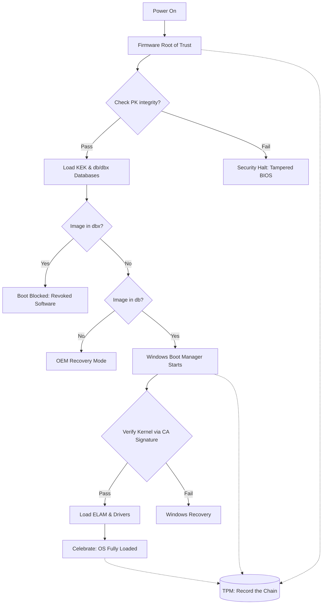
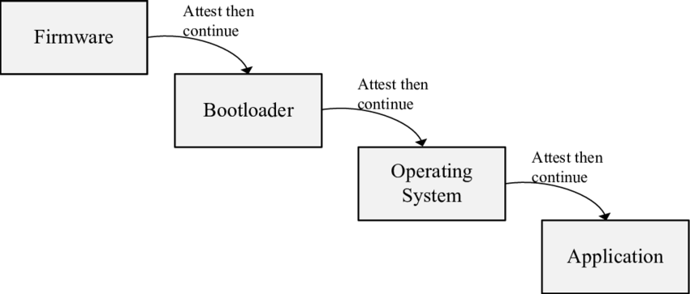

# Secure Boot
***By Filip Siliwoniuk - 305.2 : Cybersecurity***

Secure boot is a security feature to ensure that a device boots using only software that is trusted by the **Original Equipment Manufacturer** (OEM). It supports modern Windows, Linux, etc.

Secure boot initiates a boot sequence process that checks and verifies that only authorized executable files run on the PC.

## Diagram of key/signature and certificate exchange in Secure Boot

1. The Root of Trust contins the Root Certificate pre-installed by the OEM (Microsoft or PC manufcaturer).
2. Then, the hardware looks at the bootloader's Digital Certificate and checks if it was signed by the Root Certificate.
3. Once the certificate is verified as "trusted", the hardware uses the public key inside the ceritifcate to verify the Digital Signature of the bootloader file (Checking if it was not tampered with).
4. The bootloader then does the exact same for the OS kernel. Then the kernel does it for drivers.

## How to enable/disable
To change Secure Boot status, see the tutorial in the [Secure-Boot_tutorial.md](Secure-Boot_tutorial.md) file.

## Advantages of Secure Boot
- It eliminates the execution of malicious data on our system. It ensures that only authenticated and unaltered components are loaded during the boot process to main system's integrity.
- It prevents unauthorized modification to the boot process.
- Secure boot adds a security layer to remote or cloud-based management, as an image server.

## Disadvantages of Secure Boot
- Restricts users from installing alternative operating systems.
- Blocks a software if its signature is not matched or invalid.
- It can be exploited through vulnerabilities in the firmware, hardware.
- It increases the complexity of the boot process.

## Boot sequence
The secure boot functionality follows a list of events on any computer.

Here is a detailed explanation of the boot sequence:

1. **Initialization of UEFI Firmware**

    The boot sequence begins with UEFI code execution on the CPU which is stored in a non-volatile memory chip on the motherboard. After that, the Power-On Self Test (POST) is executed to check the hardware components and ensure they are functioning properly. If any issues are detected, the boot process will end and an error message will be displayed.

2. **Verification of Firmware Integrity**

    The UEFI firmware establishes a root of trust for the boot process.
    The Platform Key (PK), the highest-level cryptographic key in the UEFI architecture is used for establishing trust between the hardware owner and the firmware to enable Secure Boot.

    The PK is used to control who is allowed to update the security settings of the firmware. Without the PK, it won't be possible to modify the list of "trusted" software to run on the computer. It establishes a relationship between the hardware manufacturer and the machine.

3. **Signature checking**

    The boot sequence check the digital signature of the Bootloader and executable files against a database of trusted signatures.

    The root of trust is a source that is **always trusted** in the system.

    If the UEFI is verified as clean, it uses that trust to check the next items in the `Chain of Trust`.

    At the same time as signature checking step is happening, the boot process utilizes a hardware Root of Trust for Measurement (RTM). The **Trusted Platform Module (TPM)** uses specific Platform Configuration Registers (PCRs) to securely store cryptographic hashes (measurements) of these boot components as they load:

    - **PCR 0**: Core System Firmware executable code (Firmware).
    - **PCR 2**: Extended or pluggable executable code (Option ROMs).
    - **PCR 4**: Bootloader and additional drivers.
    - **PCR 7**: Secure Boot state.

    1. The **UEFI Firmware** verifies the Bootloader.
    2. The **Bootloader** verifies the Operating System Kernel
    3. The **Kernel** verifies the signed drivers and modules.

    If any component does not match its expected signature, the boot process is stopped.

4. **Loading the Bootloader**

    The UEFI loads the bootloader into the PC's memory. Then the bootloader verifies the the system kernel and gives access to it if is valid.

5. **Operating System verification**

    The bootloader then verifies the integrity of operating system kernel and any other components before loading them.
    Bootloaders will prevent the OS from loading if there are any unauthorized changes or malware.

## Secure Boot keys
Secure Boot is built around a Platform Key (PK) and a Key Exchange Key (KEK) system with a databse of trusted and forbidden signatures.

### Platform Key (PK)
- Top-level key in the UEFI Secure Boot architecture.
- OEM controls the PK at the time of system manufacture.
- End users or entreprises can replace the PK if they want the full control of the Secure Boot policy (Our case in this project).
- Its primary function is to authorize changes to the KEK database. The KEK database is used to authorize updates to the Signature Database (db).

### Key Exchange Key (KEK)
- Acts as the intermediate authority for managing updates to the trust databases.
- Enables a flexible and scalable trust model, allowing the PK owner to delegate control to OS vendors or administrators while maintaning the integrity of the Secure Boot process.
- Supports multiple keys to enable third-party OS or driver vendors to contribute signed software/binaries.

### Signature databases
- `db`: Holds the list of trusted signatures, certificates and hashes.
- `dbx`: Holds the list of revoked or blacklisted signatures, certificates and hashes.

## Signing third-party software
Public keys of OS vendors (OSVs), such as Microsoft or Linux, are not signed by the PK. Instead, the process works as follwows:
- OS vendors works with PK owner (OEM or manufacturer) to include their signing keys or certificates in the `db`.
- This is done at the time of system manufcaturing or setup:
    
    1. OS vendor provides their **public key** or certificate.
    2. PK owner (OEM for example) **authorizes the addition** of the OS vendor's key to the `db` by signing it with the PK. The PK is used to cryptographically sign the **transaction** that updates the `db` or `KEK` allowing the OS vendor's key to be added. 

## Shim
Microsoft maintains a signing key and public certificate widely recognized in Secure Boot envrionments on consumer devices like laptops and desktops in the UEFI Secure Boot implementation.

To enable Linux distributions to boot on Secure Boot-enabled systems, Microsoft created a small bootloader called **Shim**.

Shim is a small "**bridge**" between Secure Boot and the main Linux bootloader. Shim itself is signed with a key trusted by the firmware, most often a Microsoft signature, because Microsoft's certificates are pre-installed in UEFI on many devices.

Process order:

1. Secure Boot verifies Shim's signature and allows it to execute.
2. Shim verifies Linux's bootloader signature according to its own rules.
3. If the test passes, Shim hands control to the Linux bootloader, which then loads the kernel and system.

## PKfail vulnerability
Some manufacturers mistakenly included cryptographic **test keys** in their production firmware.
These keys were explicitly labeled **DO NOT SHIP** or **test only** but were leaked publicly on GitHub.

These test keys were included in the `trusted database` of the device and could be used by attackers to sign malicious code.

This allowed them to bypass Secure Boot entirely and install an UEFI rootkit. 

A rootkit is a set of software tools that enable an unauthorized user to gain control of a computer system without being detected.

To avoid that, user must update their UEFI firmware (BIOS) to a version without those test keys.

## Sources
- [Windows Secure Boot Compromised! What You Need to Know by a Retired Microsoft Engineer](https://www.youtube.com/watch?v=7sYzwb6eUgQ)
- [GeekForGeeks - What is Secure Boot?](https://www.geeksforgeeks.org/computer-networks/what-is-secure-boot/)
- [How to enable Secure Boot on Think branded systems - ThinkPad, ThinkStation, ThinkCentre](https://support.lenovo.com/nz/en/solutions/ht509044-how-to-enable-secure-boot-on-think-branded-systems-thinkpad-thinkstation-thinkcentre)
- [How to enable Secure Boot (HP)](https://helpdesk.intero-integrity.com/support/solutions/articles/80000622223-how-to-enable-secure-boot-hp-)
- [Secure Boot Software Chain of Trust](https://www.researchgate.net/profile/Ali-Shuja-Siddiqui/publication/341680580/figure/fig4/AS:895848984616964@1590598450308/Secure-Boot-Software-Chain-of-Trust.png)
- [Secure Boot Explained](https://medium.com/@sekyourityblog/secure-boot-explained-every-system-boot-is-a-negotiation-of-trust-be32fb023439)
- [What Secure Boot Is and How Shim Files Work in Linux](https://ufo.hosting/en/blog/what-secure-boot-is-and-how-shim-files-work-in-linux)
- [UAPI.7 Linux TPM PCR Registr](https://uapi-group.org/specifications/specs/linux_tpm_pcr_registry/)
- [Gemini](https://gemini.google.com), used for PKfail vulnerability explanation and grammar/orthography check and the Mermaid.js diagram.