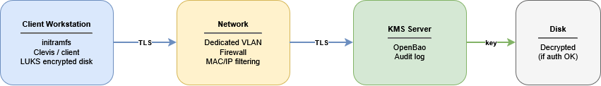

# 1. Background and objectives

## 1.1 Project background
This document describes the security architecture designed to ensure the protection of data stored on Linux workstations. The primary requirement is that no workstation should be able to boot without authenticating with a centralized key management service (KMS).

The solution is based on two complementary pillars:
- Disk encryption using LUKS (Linux Unified Key Setup)
- A centralized KMS that exclusively holds the decryption keys. Without a network connection to the KMS, the workstation is unable to mount its root filesystem.

## 1.2 Safety objective
- Data confidentiality: Any physical extraction from a disk is useless without access to the KMS.
- Centralized access control: A workstation can be revoked immediately via the KMS, making it inaccessible upon the next reboot.
- Traceability: Every decryption attempt is logged on the KMS side.
- Scalability: Adding new workstations follows a standardized process (enrollment).

# 2. KMS solution (temporary: OpenBao)
OpenBao is an open-source community fork of HashiCorp Vault, maintained under the governance of the Linux Foundation (LF Edge). It retains all of Vault's features while remaining licensed under the MPL 2.0, with no commercial restrictions.

# 2.1 Integration with LUKS via Clevis
Clevis is the client-side component that acts as the bridge between OpenBao and LUKS. It is installed in the system's initramfs and automatically handles the retrieval of the decryption key at boot time.

# 3. Architecture

## 3.1 Overview
The architecture is based on a strict client-server topology. Client machines never store the LUKS key in plain text on disk. The key is transmitted exclusively by the KMS during boot, via a TLS-encrypted channel.

No KMS response → initramfs halts → workstation unreachable

## 3.2 Deployed components
On the KMS server side:
- OpenBao Server: a service for managing keys, policies, and audits.
- Built-in Raft database: persistent storage of secrets.
- Server TLS certificate: issued by an internal CA or Let's Encrypt.

On the client side:
- LUKS: Root Volume Encryption 
- Clevis: a tool that stores the KMS access token in the LUKS metadata and retrieves the key at boot time.
- initramfs: contains Clevis and the network client for connecting to the KMS 

## 3.3 Networking and security
- Dedicated KMS VLAN: Client devices access the KMS over an isolated VLAN with no Internet access.
- Firewall: Only the KMS port is open from the user VLAN.
- MAC/IP filtering: Prevents unauthorized access.

## Sources

- Security architecture basics:  https://www.future-processing.com/blog/security-architecture-101-understanding-the-basics/
- aws security architecture: https://aws.amazon.com/what-is/security-architecture/
- OpenBao vs Hashicorp: https://lalatenduswain.medium.com/openbao-vs-hashicorp-vault-the-secrets-management-showdown-every-devops-team-needs-to-read-in-2026-458ae0d9a408
- OpenBao documentation: https://openbao.org/docs/what-is-openbao/
- mTLS: https://www.cloudflare.com/learning/access-management/what-is-mutual-tls/
- OpenBao raft: https://openbao.org/docs/configuration/storage/raft/
- Claude ai: Initial thoughts on how the overall infrastructure could be designed