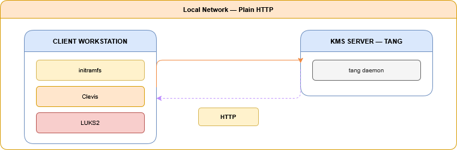

# Security Architecture — MVP

---

| Field | Value |
|---|---|
| **Scope** | 1 KMS server (Tang) + 1 client workstation |
| **Encryption** | LUKS2 |
| **KMS Client** | Clevis (PIN tang) |
| **Transport** | Plain HTTP (no TLS — MVP only) |
| **Enrollment** | Manual script — key generation and registration on the KMS |
| **Revocation** | Manual deletion of the key on the Tang server |

> **MVP objective:** *"Boot a PC only if an external service (KMS) is reachable and holds the decryption key."*

---

## 1. Context and Objectives

The MVP demonstrates the core principle of the solution: a LUKS-encrypted workstation cannot boot without obtaining its key from an external KMS. If the service is unreachable or the workstation is not enrolled, the boot process is blocked.

> **This document covers the MVP only.** Advanced security components (mutual TLS, dedicated VLAN, high availability, OpenBao/Vault) are planned for future iterations.

### 1.1 What the MVP covers

- Disk encryption of the client machine with LUKS2
- Workstation enrollment with the Tang KMS server
- Conditional boot: the workstation boots only if the KMS responds
- Boot is blocked if the KMS is unreachable

### 1.2 What the MVP does not cover (yet)

- Secure transport (no TLS — plain HTTP only)
- Mutual authentication / client certificates
- Dedicated VLAN or network isolation
- KMS high availability
- Centralized logging and alerting

---

## 2. Deployed Components

The MVP relies on two well-established open source components, simple to deploy and well suited for a proof-of-concept environment.

### 2.1 KMS Server — Tang

Tang is a lightweight key derivation server designed specifically for network-based LUKS decryption. It never stores the LUKS key directly: it participates in a cryptographic exchange (McCallum-Relyea protocol) that allows the client to reconstruct its key only in the presence of the server.

**KMS Server — Tang**
```
→  tang daemon (HTTP on port 7500)
→  Tang encryption key pair (generated at install time)
→  No database — stateless server side
→  Revocation: delete Tang key files + restart the service
```

### 2.2 Client — Clevis + LUKS2

Clevis is the client component that integrates into the workstation's initramfs. At boot time, it automatically contacts the Tang server to reconstruct the LUKS key and unlock the root volume. No key is ever stored in plaintext on disk.

**Client Workstation**
```
→  LUKS2: encrypted root volume
→  Clevis: embedded in initramfs
→  Clevis token stored in LUKS metadata (encrypted)
→  HTTP connection to Tang at boot time
```

---

## 3. MVP Architecture

### 3.1 Simplified Topology

The MVP connects two machines directly on the same local network. No intermediate component is required.



> **Tang does not store the LUKS key.** It generates an asymmetric key pair and participates in a cryptographic exchange (McCallum-Relyea protocol). Only a client holding the correct token can reconstruct the key — without ever transmitting it in plaintext over the network.

---

## 4. Enrollment Process

Enrollment is the one-time procedure by which a blank workstation is integrated into the KMS infrastructure. It is performed once per machine, in a controlled environment.

| Step | Action |
|---|---|
| **1** | Workstation boots on a live OS (or the unencrypted target OS) |
| **2** | The enrollment script generates a random LUKS key |
| **3** | The disk is encrypted with this key (`cryptsetup luksFormat`) |
| **4** | Clevis is configured with the Tang server IP address |
| **5** | Clevis contacts Tang (HTTP) and binds the token to the LUKS key (`clevis luks bind`) |
| **6** | The initial LUKS key is removed from the slot — only Tang can now unlock the volume |
| **7** | The initramfs is regenerated with Clevis embedded (`dracut` or `update-initramfs`) |
| **8** | Reboot → normal boot sequence |

---

## 5. Boot Sequence

At every startup, the following sequence is executed automatically by the initramfs:

```
[ 1 ]  BIOS/UEFI starts
[ 2 ]  GRUB loads the kernel + initramfs
[ 3 ]  Clevis (in initramfs) attempts an HTTP connection to Tang
         │
         ├─ KMS reachable ──► Tang returns its cryptographic share
         │                    ► LUKS key is reconstructed locally
         │                    ► cryptsetup unlocks the LUKS volume
         │                    ► Root filesystem is mounted → normal boot
         │
         └─ KMS unreachable ─► Clevis fails
            or not enrolled    ► cryptsetup cannot unlock the volume
                               ► Boot stops — disk remains inaccessible
```

> **KMS unreachable or workstation not enrolled:**
> Clevis fails → cryptsetup cannot unlock the volume → boot stops. The disk remains inaccessible.

---

## 6. Workstation Revocation

In the MVP, revocation is simple and immediate. The administrator deletes the Tang keys on the server. On the next boot attempt, the client workstation can no longer reconstruct its LUKS key. But none of the workstations will be able to connect anymore
---

## 7. MVP Limitations and Planned Evolutions

> The following points are known and accepted limitations of the MVP, which will be addressed in future versions of the solution.

| Domain | MVP | Planned (final version) |
|---|---|---|
| **Transport** | Plain HTTP | Mutual TLS (mTLS) with client certificates |
| **KMS** | Tang (lightweight) | OpenBao (Vault fork) with advanced policies |
| **Network** | Direct LAN | Dedicated VLAN + firewall + MAC/IP filtering |
| **Enrollment** | Manual script | Automated and audited process |
| **High availability** | None (SPOF) | Active + standby server + encrypted backups |
| **Logging** | Basic system logs | Centralized audit log + alerting |

---

## Sources

- Tang: https://github.com/latchset/tang
- Clevis: https://github.com/latchset/clevis
- LUKS / cryptsetup: https://gitlab.com/cryptsetup/cryptsetup
