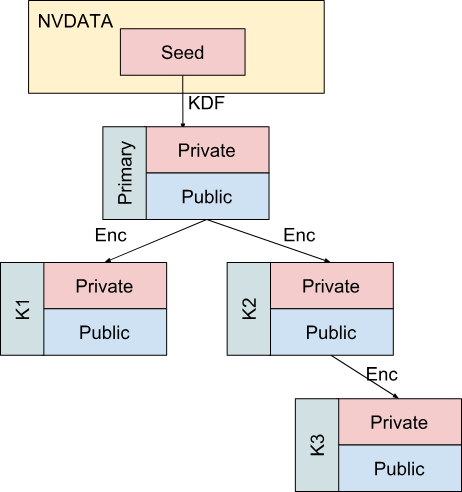
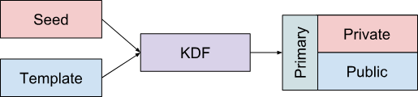

# Trusted Platform Module (TPM)

A TPM is a hardware component that let's us do cryptographic functions outside of the main system.

The problem with encrypting our drive, is that after encrypting it, we need a secure place to store this key. When a key leaves the TPM - in order to be loaded and used later - it is wrapped (encrypted) by its parent key

## Secure Key Generation

TPM is a cryptographic device. It can securely generate new cryptographic keys: the keys are only available to the TPM - private key material never leaves the device in plain form.

TPM can do crypto operations such as encryption and signing. TPM can certify new keys, so in a way a TPM acts as a certificate authority (CA). Trust in these keys is rooted in a primary key provisioned by the manufacturer or the owner of the TPM.

## Remote System Attestation

TPM can capture the host system state: this is done by storing a sequence of measurements in a special set of registers called Platform Configuration Registers (PCRs). The TPM can later report its PCR values to a remote party. It is done in a secure way such that the remote attester can verify the report is fresh, genuine, and has not been tampered with.

## Check for TPM
To see whether you have a TPM, try the following commands:

```sh
cat /sys/class/tpm/tpm0/device/firmware_node/description
```
```sh
cat /sys/class/tpm/tpm0/device/description
```
```sh
systemd-analyze has-tpm2
```

## Keys

What makes the TPM so secure, is it's secure key generation. It generates it's primary key using a fixed seed stored in the TPMs NVDATA, which is externally unreachable. It creates keys in a hierarchy (tree structure) each with their own purpose following a strict "parent-child" relationship:

- **The Root (The Seed)**: This is the master secret. It never leaves the TPM and is used to mathematically "grow" everything below it.
- **The Primary Objects**: These are the first keys created directly from the seed. For example, in the Owner hierarchy, [**the Storage Root Key (SRK)**](#storage-root-key-srk) is a primary object.
- **Child Objects**: These are the keys you actually use, like a key to encrypt your hard drive or a key to sign a digital document. These are "wrapped" (encrypted) by their parent keys.



**Primary keys** are derived from the primary seeds using a deterministic key derivation function (KDF). More accurately, the KDF takes as input the fixed seed and the key's template that describes its properties.



> [!Note]
> A template is a blueprint that defines how a key is created, which includes:
> - **Algorithm**: Is this an RSA 2048-bit key? An ECC NIST P-256 key?
> - **Attributes**: This is the most important part. It defines what the key is allowed to do.
>   - `sign`: Can it be used to sign documents?
>   - `decrypt`: Can it be used to unlock data?
>   - `restricted`: Is it limited to only signing data that the TPM itself generated?
>   - `fixedTPM` : Can this key ever be exported to another computer? (Usually "No").
> - **Policy**: Does the user need to provide a PIN to use this key? Does Secure Boot need to be "On"?

The four seeds create "firewalled" zones in the TPM. The **Endorsement** seed proves the hardware is real, the **Platform** seed protects the BIOS, the **Owner** seed protects your OS/files, and the **Null** seed handles temporary tasks that vanish when you reboot. Each seed has it's own hierarchy of keys.

[Cryptographic Keys - TPM-JS](https://google.github.io/tpm-js/#pg_keys)

### Storage Root Key (SRK)

The Storage Rook Key (SRK), is a **primary**, restricted encryption key on the owner hierarchy, derived from the seed. The SRK protects keys on the owner hierarchy. It is trusted because the owner certified the key while when ownership.

## Platform Configuration Registers (PCRs)

| PCR | Description | Extended by |
| :--- | :--- | :--- |
| PCR0 | Core System Firmware executable code (aka Firmware). May change if you upgrade your UEFI. | Firmware |
| PCR1 | Core System Firmware data (aka UEFI settings; configured boot order, for example) | Firmware |
| PCR2 | Extended or pluggable executable code (aka OpROMs) | Firmware |
| PCR3 | Extended or pluggable firmware data. Set during Boot Device Select UEFI boot phase. | Firmware |
| PCR4 | Boot Manager Code and Boot Attempts. Measures the boot manager and the devices that the firmware tried to boot from. | Firmware |
| PCR5 | Boot Manager Configuration and Data. Can measure configuration of boot loaders; includes the GPT Partition Table. | Firmware |
| PCR6 | Resume from S4 and S5 Power State Events | Firmware |
| PCR7 | Secure Boot State. Contains the full contents of PK/KEK/db, as well as the specific certificates used to validate each boot application[2] | Firmware, shim (adds MokList, MokListX, and MokSBState) |
| PCR8 | Hash of the kernel command line | GRUB |
| PCR9 | Hash of the initramfs and EFI Load Options | Linux (measures the initramfs and EFI Load Options, essentially the kernel cmdline options) |
| PCR10 | Reserved for Future Use | |
| PCR11 | Hash of the Unified kernel image | systemd-stub(7) |
| PCR12 | Overridden kernel command line, Credentials | systemd-stub(7) |
| PCR13 | System Extensions | systemd-stub(7) |
| PCR14 | shim's MokList, MokListX, and MokSBState.[3] | shim |
| PCR15 | Hash of the LUKS volume key | systemd-cryptsetup |
| PCR16 | Debug. May be used and reset at any time. May be absent from an official firmware release. | |
| PCR23 | Application Support. The OS can set and reset this PCR. | |

[Accessing PCR registers - ArchWiki](https://wiki.archlinux.org/title/Trusted_Platform_Module#Accessing_PCR_registers)

## Sources

[TPM - ArchWiki](https://wiki.archlinux.org/title/Trusted_Platform_Module)
[The ultimate guide to Full Disk Encryption with TPM and Secure Boot - Philippe Daouadi](https://blastrock.github.io/fde-tpm-sb.html)
[TPM-JS](https://google.github.io/tpm-js/)