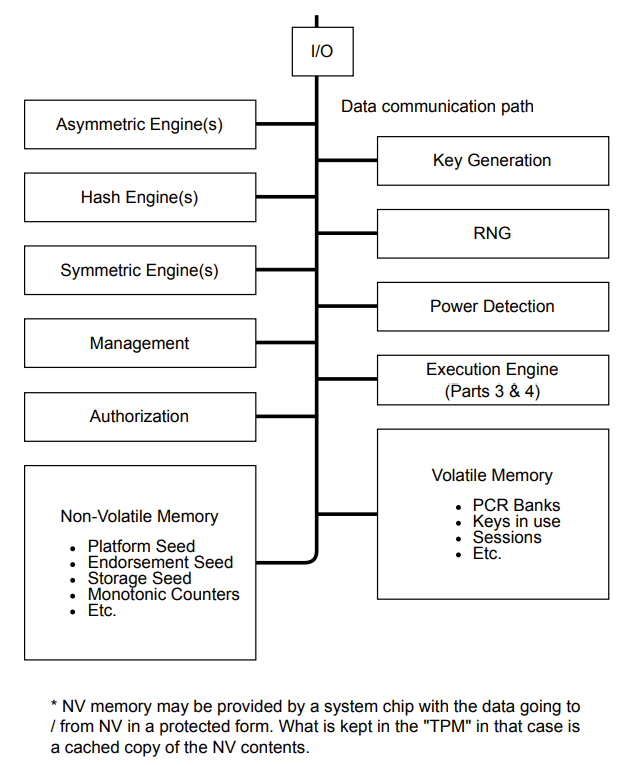
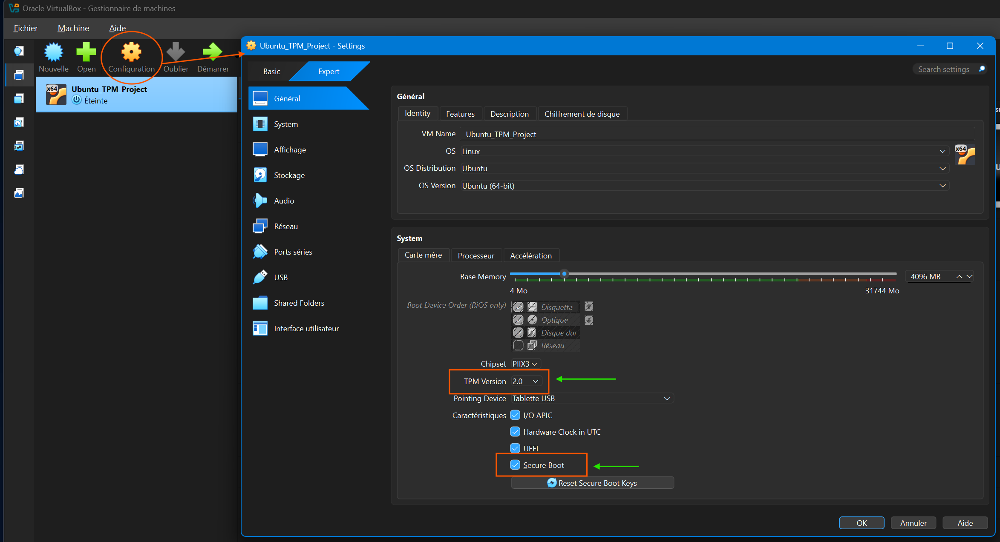

## What is TPM?

A **Trusted Platform Module (TPM)** is a secure cryptoprocessor that implements the [ISO/IEC 11889](https://www.iso.org/standard/66510.html) standard — a dedicated microprocessor designed to secure hardware by integrating cryptographic keys into devices. The chip includes multiple physical security mechanisms to make it tamper-resistant, and malicious software is unable to tamper with its security functions. In practice a TPM can be used for various security applications such as:

- **Cryptographic key management** — generate, store, and limit the use of cryptographic keys. Keys are created inside the TPM's own processor and held in shielded memory that the host cannot read; signing and encryption can happen without the key ever leaving the chip.
- **Device authentication** — authenticate a device by using the TPM's unique Endorsement Key (EK), an asymmetric key pair (RSA or ECC) provisioned into non-volatile memory at manufacturing time. This key acts as the device's fingerprint, proving "this is a real and specific device."
- **Platform integrity** — ensure platform integrity by taking and storing security measurements of the boot process (secure boot). At each stage (firmware → bootloader → kernel), the next stage is hashed and `Extend`ed into a PCR register inside the TPM; any change anywhere in the chain shifts the PCR value and can be detected.
- **Disk encryption** — store disk encryption keys so they are only released when the system is in a trusted state. The TPM seals an encryption key against expected PCR values; at unseal time, if the PCRs still match, the key is released — otherwise the TPM refuses. This is how TPM-backed LUKS auto-unlock works.
- **Random number generation** — provide a hardware source of entropy for cryptographic operations. The TPM contains a physical noise generator that produces true randomness, unlike software-based PRNGs which are ultimately deterministic.



*The relevant components of this architecture are explained in detail in the following sections.*

The host cannot access the TPM's internal memory directly. We interact with the TPM through the `TPM2_*` command set. To install these tools on Ubuntu:

```bash
sudo apt install tpm2-tools
```

## Core Concepts

### Hardware Root of Trust (HRoT)

The TPM is the real-world implementation of the **Hardware Root of Trust (HRoT)** idea. If you want to trust a system, the lowest layer of trust must be hardware, not software. Software can be changed or compromised remotely; compromising hardware requires physical access. That is why security functions are kept in a separate hardware component (the TPM) that the host cannot reach.

### Trusted Platform

In TCG terminology, "trust" does not mean "morally good" — it means **an expectation of behavior**. A trusted platform is a system whose hardware and software components can be *identified*, so an outside observer can decide whether the platform will behave as expected. The TPM is the component that collects and reports these identities — that is why every trusted platform is built around one.

The TCG requires a trusted platform to provide three Roots of Trust:

#### Three Roots of Trust

- **RTM — Root of Trust for Measurement.** The component that measures what is running on the system. Here "measurement" means taking the hash (fingerprint) of a piece of software. At boot, the CPU runs the first code (CRTM) and sends the hash of each stage — firmware, bootloader, kernel — to the TPM.
- **RTS — Root of Trust for Storage.** Where the hashes sent by the RTM are stored — they are kept in PCR registers inside the TPM's protected internal memory. Keys are also stored here. They cannot be read or changed from outside in any way.
- **RTR — Root of Trust for Reporting.** The TPM's ability to sign the PCR values (hashes) stored in the RTS and report them externally. Keys and sealed data are never reported — only hashes that show the system state are shared.

#### CRTM (Core Root of Trust for Measurement)

The CRTM is the very first piece of code the CPU runs when the system starts — it is the starting point of the trust chain. It is responsible for measuring the rest of the platform. At every boot, the CRTM kicks in, measures the next stage (firmware), and writes that measurement to a PCR in the TPM. If the CRTM is tampered with, the entire chain becomes untrustworthy.

### TPM is a General-Purpose Security Chip

The five features listed above are independent of each other. The TPM does not need Secure Boot or disk encryption to function — it is a general-purpose security chip, not a single-purpose tool tied to one specific task.

**TPM without Secure Boot.** The TPM still measures the boot process and writes hashes into PCR registers even when Secure Boot is disabled. The difference is that without Secure Boot, there is no signature verification — the TPM records what happened, but nothing stops an unsigned or malicious bootloader from running. The measurements are still accurate, but no one is acting on them to block untrusted software.

**TPM without disk encryption.** The TPM still handles key management, device authentication, platform integrity measurements, random number generation, and remote attestation — all without any encrypted disk. For example, Windows 11 requires a TPM even if BitLocker is never enabled, because it uses the TPM for Windows Hello (biometric login), Credential Guard, and Secure Boot verification.

**All three together.** The strongest setup combines TPM + Secure Boot + disk encryption. Secure Boot verifies that only trusted software runs, the TPM records and enforces the expected system state, and disk encryption (LUKS/BitLocker) protects data at rest. If any piece of the boot chain is tampered with, the TPM refuses to release the disk encryption key.

### The Trust Chain: From Boot to Disk Unlock



*VirtualBox settings for our Ubuntu VM: TPM Version is set to 2.0, UEFI is enabled, and Secure Boot is checked. All three must be active before installing Ubuntu with LUKS full disk encryption.*

> **Note:** LUKS (Linux Unified Key Setup) is not the same thing as disk encryption — it is one implementation of it, specific to Linux. Other implementations include BitLocker (Windows), FileVault (macOS), and VeraCrypt (cross-platform). We focus on LUKS here because our project runs on Linux.

```
┌──────────┐       ┌──────────────┐       ┌────────────────┐       ┌──────────┐
│          │       │              │       │                │       │          │
│   CRTM   │──────▶│   Firmware   │──────▶│   Bootloader   │──────▶│  Kernel  │
│          │       │   (UEFI)     │       │  (GRUB/shim)   │       │          │
└─────┬────┘       └──────┬───────┘       └───────┬────────┘       └─────┬────┘
      │                   │                       │                      │
      │ hash              │ hash + verify         │ hash + verify        │ hash
      ▼                   ▼                       ▼                      ▼
┌────────────────────────────────────────────────────────────────────────────────┐
│                                                                                │
│                         TPM  ─  PCR Registers                                  │
│                  (all measurements accumulated here)                           │
│                                                                                │
└───────────────────────────────────┬────────────────────────────────────────────┘
                                    │
                          PCRs match expected?
                                    │
                       ┌────────────┴────────────┐
                       ▼                         ▼
                ┌─────────────┐          ┌──────────────┐
                │     YES     │          │      NO      │
                │             │          │              │
                │ TPM releases│          │ TPM refuses. │
                │  LUKS key   │          │ Disk stays   │
                │             │          │   locked.    │
                └──────┬──────┘          └──────────────┘
                       ▼
                ┌─────────────┐
                │             │
                │ Disk unlock │
                │             │
                └─────────────┘
```

Each stage hashes the next before passing control. Secure Boot additionally **verifies** signatures at each step. The TPM seals the LUKS key against these accumulated measurements — if any stage is tampered with, the PCR values change and the key is never released.

### TPM + LUKS: System Lifecycle

> **Sealing** means giving data to the TPM and saying "store this, only give it back when the PCR values match what they are right now." The TPM locks (seals) the data; later it unlocks (unseals) it — but only if the system state has not changed. **Enrollment** is the one-time process of sealing a key into the TPM and registering it in the LUKS header, so that the two can work together from that point on.

The project description defines two distinct states for a TPM-backed encrypted system:

**1. Provisioning (enrollment)**

The disk is already encrypted with LUKS but the TPM is not yet involved — the user must type a passphrase at every boot. Enrollment connects the two: a random key is generated, sealed into the TPM against the current PCR values, and written into a new LUKS keyslot + token. The existing passphrase keyslot is left untouched.

```bash
sudo systemd-cryptenroll --tpm2-device=auto --tpm2-pcrs=7 /dev/sda3
```

```
Before:                                  After:
┌─────────────────────────┐              ┌─────────────────────────┐
│ Keyslot 0: passphrase   │              │ Keyslot 0: passphrase   │ (untouched)
│ Keyslot 1: (empty)      │              │ Keyslot 1: TPM-sealed   │ (new)
│ Tokens:    (empty)       │              │ Tokens:    systemd-tpm2 │ (new)
└─────────────────────────┘              └─────────────────────────┘
```

**2. Automated decryption (every subsequent boot)**

At boot, systemd reads the token from the LUKS header, asks the TPM to unseal the key, and if the PCR values match, the disk is unlocked without a passphrase. If the PCRs do not match (e.g. the boot chain was tampered with), the TPM refuses and the system falls back to asking the user for a passphrase.

**3. After unseal: the key is in RAM**

Once the TPM releases the key and it is handed to dm-crypt, it sits in RAM like any other data — the TPM's protection ends at that point. This means TPM sealing protects against **offline disk theft** (the disk cannot be opened on a different machine) but does **not** protect against a memory dump attack on the running system. The `aeskeyfind` attack described in the "Breaking FDE" phase of this project works exactly the same way on a TPM-unlocked system — because the key is still in RAM.


## Our Setup

- VirtualBox + Ubuntu 24.04
- swtpm (Software TPM 2.0)
- LUKS2 + AES-XTS-512


## Glossary

- **TCG** — Trusted Computing Group. The industry consortium that defines the TPM specification and related standards.
- **TPM** — Trusted Platform Module. A hardware (or firmware-emulated) crypto-processor that implements the TCG specification.
- **HRoT** — Hardware Root of Trust. The principle that the lowest layer of system trust must live in dedicated hardware rather than software.
- **RTM / RTS / RTR** — Roots of Trust for Measurement / Storage / Reporting. The three mandatory roots every trusted platform must provide.
- **CRTM** — Core Root of Trust for Measurement. The very first piece of code that runs after a system reset; it is the starting point of the RTM's measurement chain.
- **PCR** — Platform Configuration Register. A small, fixed-size slot inside the TPM into which integrity measurements are accumulated via the `Extend` operation.
- **`TPM2_*`** — Prefix for all TPM 2.0 commands defined by the TCG (e.g., `TPM2_Quote`, `TPM2_Unseal`, `TPM2_PCR_Extend`).
- **EK** — Endorsement Key. A unique asymmetric key pair (RSA or ECC) that identifies a specific TPM; provisioned at manufacturing time with a manufacturer-issued certificate.
- **Extend** — The PCR update operation `PCR_new = Hash(PCR_old || measurement)`, which lets a fixed-size PCR accumulate an unbounded sequence of measurements.
- **Sealing / Unsealing** — The TPM operations that wrap data under a policy and later release it only if that policy (e.g., expected PCR values) still holds; used to bind a secret to a specific platform state.
- **LUKS** — Linux Unified Key Setup. A disk encryption standard for Linux that uses `dm-crypt` as its backend.

## Summary: What TPM Does and Does Not Do

The TPM is not a firewall — it does not block anything. It works more like a **notary**: it records what happened, but does not stop it from happening.

- The TPM **does not prevent** a malicious bootloader from running — if someone tampers with the boot chain, the system still boots.
- But the TPM **accurately records** what happened — the PCR values change and that change is detectable.
- The TPM **does not decide** what to do about it — that decision belongs to another mechanism (e.g., a sealing policy refuses to release the LUKS key, or a remote server denies access after checking a quote).

In short: the TPM says "I won't stop you, but I will tell everyone what you did." The enforcement happens elsewhere.

## Sources

- [ArchWiki — Trusted Platform Module](https://wiki.archlinux.org/title/Trusted_Platform_Module)
- [Wikipedia — Trusted Platform Module](https://en.wikipedia.org/wiki/Trusted_Platform_Module)
- [Wikipedia — Linux Unified Key Setup](https://en.wikipedia.org/wiki/Linux_Unified_Key_Setup)
- [TCG — TPM 2.0 Keys for Device Identity and Attestation](https://trustedcomputinggroup.org/wp-content/uploads/TPM-2p0-Keys-for-Device-Identity-and-Attestation_v1_r12_pub10082021.pdf)
- [Red Hat — Encrypting Block Devices Using LUKS](https://docs.redhat.com/en/documentation/red_hat_enterprise_linux/8/html/security_hardening/encrypting-block-devices-using-luks_security-hardening)
- [TCG — TPM 2.0 Library Part 0: Introduction (official spec)](https://trustedcomputinggroup.org/wp-content/uploads/Trusted-Platform-Module-2.0-Library-Part-0-Introduction_Version-185_pub.pdf) — for a deeper look at TPM internals (certification, attestation hierarchy, integrity measurement, protected locations)
- [Phillipe Daouadi — Décrypter un disque LUKS avec TPM](https://blog.tartarefr.eu/fr/blog/dechiffrer-disque-luks-avec-tpm) — TPM-LUKS unlock walkthrough (French)