# Phase 3 — Hardening the Boot Chain with Secure Boot

**Author:** Unal Külekci

## Goal

Secure Boot is a UEFI security standard that creates a "Chain of Trust" starting at the hardware level. The firmware checks the digital signature of each boot component. If a signature is missing or invalid, the system refuses to boot.

By default, motherboards ship with Microsoft's public keys. In this phase, we take full ownership of the platform: generate our own cryptographic key pair (PK, KEK, db), sign boot components, and configure UEFI to trust only our keys.

Terms:

- **Custom key** = Our own keys (PK, KEK, db) instead of Microsoft/vendor keys.
- **Enrollment** = The act of loading these keys into UEFI. Putting them in UEFI's vault.
- **Custom key enrollment** = Loading our own keys into UEFI.

**Scope:** No LUKS, no TPM. Ubuntu install, Secure Boot custom key enrollment, UKI creation signed by the same db key, and UEFI BootOrder change to boot the UKI first.

**Document layout:**

- **This file** (`setup-and-baseline.md`) — VM setup, Ubuntu install, Secure Boot checks, and the "before" snapshot of the current UEFI keys.
- **[key_generation.md](key_generation.md)** — GUID generation, PK/KEK/db key and certificate creation, trust chain verification.
- **[efi_conversion.md](efi_conversion.md)** — convert certs to UEFI ESL/auth format, sign GRUB and kernel, enroll keys into UEFI, reboot validation.
- **[uki.md](uki.md)** — close the initrd gap with a Unified Kernel Image, signed by the same db key.

## Environment

- **Host OS:** Windows 11 Pro
- **Hypervisor:** VirtualBox 7.2.6 (current version, with UEFI and TPM support)
- **Guest OS:** Ubuntu 24.04 LTS

## Step 1 — Creating the VM

We create an Ubuntu virtual machine in VirtualBox. We set some options by hand.

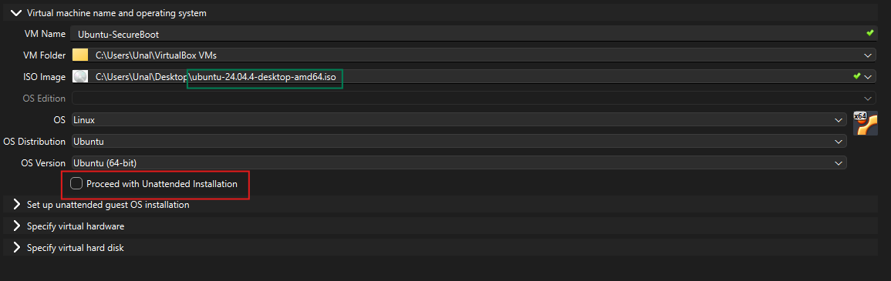

## Step 2 — RAM, Processor and EFI Settings

We give the VM more RAM and more processor cores. We also turn on EFI.

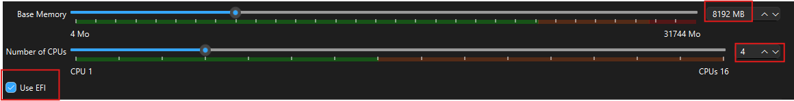

## Step 3 — Disk Settings

I set the disk size to 40 GB for the VM.

- 25 GB is enough to start, but it can get tight later. 40 GB is safer.
- **File Type:** VDI (VirtualBox Disk Image) — I keep the default.
- **Pre-allocate Full Size:** I leave this unchecked. When it is off, the VDI grows as needed and only uses the space I really use. If I check it, VirtualBox takes the full 40 GB right away.

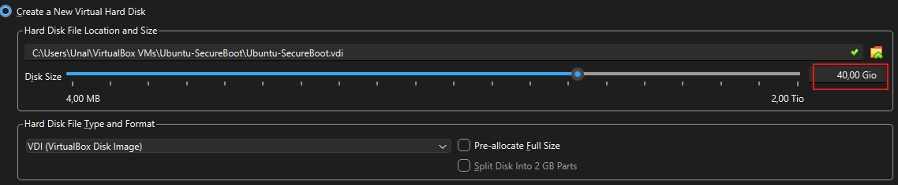

> **NOTE:** Without EFI, I cannot use Secure Boot. Do not skip this part.

## Step 4 — Secure Boot, TPM and Chipset Settings

I change three things:

1. I check the **Secure Boot** box.
2. I set **TPM Version** to `v2.0`. I will need it later in Phase 2 (TPM with LUKS sealing). It is easier to turn it on now.
3. I set **Chipset** to `ICH9`. PIIX3 is an old chipset and does not always work well with UEFI/Secure Boot. ICH9 is newer and made for UEFI.

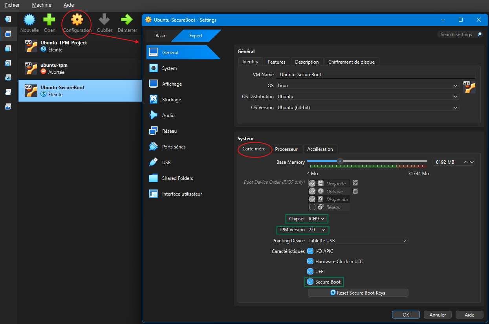

### The "Reset Secure Boot Key" Button

The button name is misleading: "Reset" here means "load VirtualBox's default keys" (Oracle PK, Microsoft KEK, Microsoft/Canonical db), not "clear everything".

I click it so Ubuntu can boot normally during install with Microsoft's signed shim. I will replace these keys with my own in Step 8+.

**Steps:**

1. Keep Secure Boot on.
2. Click "Reset Secure Boot Key" → "Yes".
3. Check that TPM is `v2.0` and Chipset is `ICH9`.
4. Save with OK.


### Installing Ubuntu

After the VM settings are done, I click **Start** and run a normal Ubuntu install. I keep the default options for most screens.

> **NOTE:** I pick "Minimum installation" and I do **not** choose "Encrypted installation". Phase 3 does not need LUKS.

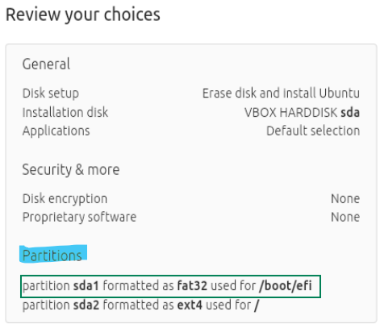

*Two things matter here: "Disk encryption: None" (no LUKS) and `sda1 → /boot/efi` (the ESP is ready — this is where I will sign files later).*

- **Disk encryption:** None (no LUKS in Phase 3).
- **Partitions:**
  - `sda1` → FAT32, mounted at `/boot/efi` → EFI System Partition (ESP). The bootloader lives here.
  - `sda2` → ext4, mounted at `/` → main Linux filesystem.
- **Important:** Later I will sign `grubx64.efi` and the kernel with `db.key`, then build a signed UKI (`my_ubuntu.efi`) that UEFI boots directly. `shimx64.efi` is skipped; signed GRUB stays as a fallback. Working folder: `/boot/efi/EFI/ubuntu/`.

## Step 5 — Verifying Secure Boot is Active

After Ubuntu is installed, I check that Secure Boot is really on.

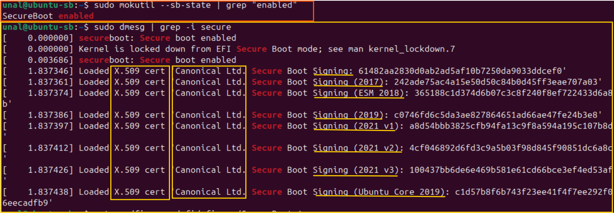

### mokutil --sb-state

```bash
# SecureBoot enabled
sudo mokutil --sb-state | grep "enabled"
```

`mokutil` (Machine Owner Key utility) asks the system about Secure Boot. If the output says "enabled", Secure Boot is active at the UEFI level.

### dmesg | grep -i secure

```bash
sudo dmesg | grep -i secure
# or
journalctl -kg 'secure boot'
```

`dmesg` shows the kernel ring buffer for the current session. `journalctl -k` shows the same kernel messages, but it keeps them on disk, so I can still read them after a reboot. The `-g` flag filters with a regex.

I read the messages the kernel prints during boot:

1. **`secureboot: Secure boot enabled`** — The kernel sees that Secure Boot is active.
2. **`Kernel is locked down from EFI Secure Boot mode`** — Lockdown mode is active.
3. **`Loaded X.509 cert 'Canonical Ltd. Secure Boot Signing...'`** — The kernel loaded Canonical's certificates into its internal key ring. I see several dates (2017, 2018, 2019, 2021 v1/v2/v3) because Canonical rotates its keys from time to time.

### Current trust chain

```
UEFI db (VirtualBox default):
├── Microsoft Windows Production PCA 2011
├── Microsoft Corporation UEFI CA 2011
└── Canonical Ltd. Master CA
     ├── shim (Ubuntu's bootloader bridge)
     └── Canonical Secure Boot Signing certificates
          ├── GRUB (grubx64.efi)
          ├── Kernel (vmlinuz)
          └── Kernel modules
```

### Target trust chain after the project

```
UEFI db (custom):
└── My certificate
     ├── GRUB
     ├── Kernel
     └── Kernel modules
```

Canonical and Microsoft are no longer in this chain. I become the only trusted signer.

## Step 6 — Installing the Required Tools

```bash
sudo apt update
sudo apt install -y efitools sbsigntool openssl uuid-runtime
```

| Package | What it does | Source |
|---|---|---|
| `efitools` | Manages UEFI variables. It includes: `efi-updatevar` (write UEFI variables), `efi-readvar` (read the current PK/KEK/db), `cert-to-efi-sig-list` (turn a certificate into UEFI format), `sign-efi-sig-list` (create a signed signature list). | [kernel.org/efitools](https://git.kernel.org/pub/scm/linux/kernel/git/jejb/efitools.git/about/) |
| `sbsigntool` | Signs and verifies EFI binaries. I use `sbsign` to sign the bootloader and kernel, and `sbverify` to check if a signature is valid. | [kernel.org/sbsigntools](https://git.kernel.org/pub/scm/linux/kernel/git/jejb/sbsigntools.git/about/) |
| `openssl` | Creates RSA key pairs and X.509 certificates. I will make a separate key and certificate for PK, KEK, and db. | [openssl.org](https://www.openssl.org/) |
| `uuid-runtime` | Gives me `uuidgen` to create GUIDs. UEFI tags every key owner with a GUID, so I need a unique one during enrollment. | [stackoverflow/uuidgen](https://stackoverflow.com/questions/17710958/how-do-i-install-uuidgen) |

Quick check after the install:

```bash
which sign-efi-sig-list sbsign openssl uuidgen
```

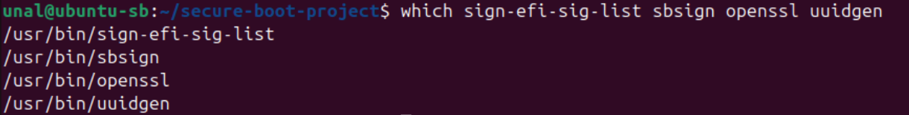

### Recording the Current UEFI Keys (The "Before" Snapshot)

Before I load my own keys, I save what UEFI has right now. This "before vs. after" comparison will be the proof for Phase 3.

```bash
mkdir -p ~/secure-boot-project/before
cd ~/secure-boot-project/before
sudo efi-readvar > uefi-keys-before.txt
cat uefi-keys-before.txt
```

- `efi-readvar` → reads the PK, KEK, db, and dbx stored in UEFI.
- Lines that start with `CN=` show the owner of each certificate.
- After the project, when I run the same command, I should only see my own certificate.

**PK (Platform Key) — 1 entry:**

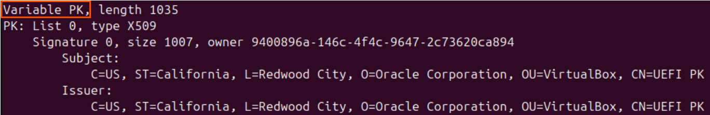

- Subject: `Oracle Corporation, OU=VirtualBox, CN=UEFI PK`
- Issuer: the same as the subject (self-signed certificate). Oracle signed its own certificate.
- VirtualBox loads this PK by default for every new VM.
- On a real machine, the PK belongs to the laptop maker (for example, Lenovo). Here the "platform" is VirtualBox's virtual motherboard, so the owner is Oracle.

**KEK (Key Exchange Key) — 2 entries:**

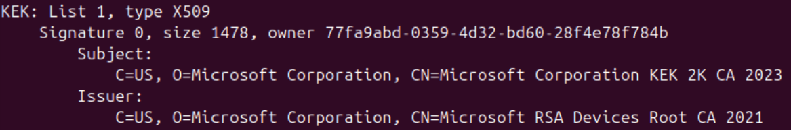

- **List 0:** `Microsoft Corporation KEK CA 2011` — the old key, still valid.
- **List 1:** `Microsoft Corporation KEK 2K CA 2023` — the newer key ("2K" = 2048-bit RSA).
- Microsoft owns the KEK because Windows bootloader signing and db/dbx updates (like the BlackLotus revocation list) are done with this key.

**db (Signature Database):**

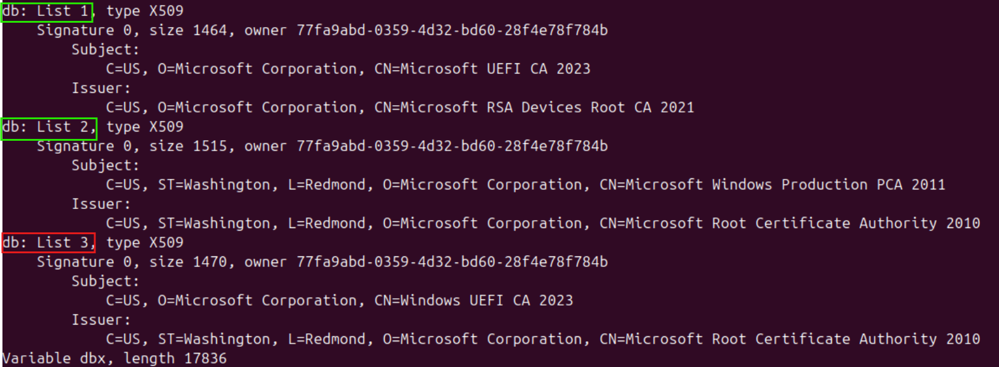

- db stores **certificates**. One certificate covers every binary it signed, so I do not need to list each file one by one.
- **Observation:** There is no Canonical key in db, only Microsoft. So how does Ubuntu boot? Through **shim**: `shimx64.efi` is Microsoft-signed, and shim has Canonical's public key embedded to verify the kernel. UEFI never talks to Canonical directly — shim is the bridge.
- **In my project:** I skip shim. GRUB is signed directly by my own key, so the bridge layer is gone.

**dbx (Forbidden Signature Database) — 370 banned hashes:**

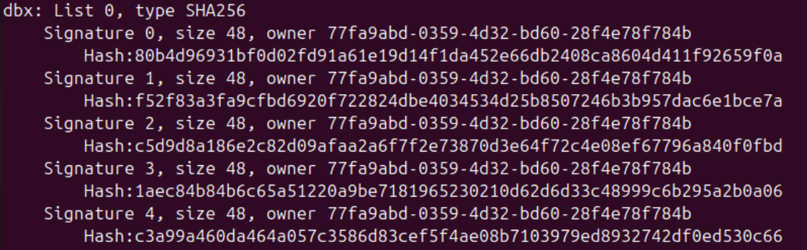

- dbx stores **hashes**, not certificates. Why hashes? To block one specific file, not its signer. If I revoked the certificate, every other valid binary signed by it would also break.
- The 370 hashes here are mostly known-vulnerable bootloaders (for example, old shim/GRUB versions from the BlackLotus exploit).

#### Example: The Story Behind One dbx Hash

One hash in dbx, `80b4d96931bf0d02fd91a61e19d14f1da452e66db2408ca8604d411f92659f0a`, belongs to a known UEFI boot manager vulnerability. Details: [Microsoft Security Advisory 2871690](https://learn.microsoft.com/en-us/security-updates/securityadvisories/2014/2871690)

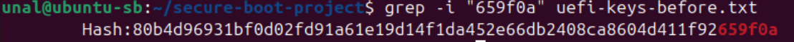

#### Where to Find dbx and UEFI Revocation Data

If I want to look up banned bootloaders and the latest revocation lists:

- [UEFI Revocation List (official)](https://uefi.org/revocationlistfile) — the current dbx list published by the UEFI Forum.
- [Microsoft Security Response Center](https://msrc.microsoft.com/update-guide/) — Microsoft's security updates and banned binaries.
- [Eclypsium — "There's a Hole in the Boot"](https://eclypsium.com/research/theres-a-hole-in-the-boot/) — research on GRUB2 vulnerabilities (BootHole) and the hashes added to dbx.

## Step 7 — Exploring the Current Boot Setup (Baseline Evidence)

Before I load my own keys, I document how the system boots right now. At the end of the project I run the same commands again for a "before vs. after" comparison.

### 7.1 UEFI Variables — Where the Keys Live

```bash
ls -la /sys/firmware/efi/efivars/ | grep -iE "PK-|KEK-|db-|dbx-|SecureBoot"
```

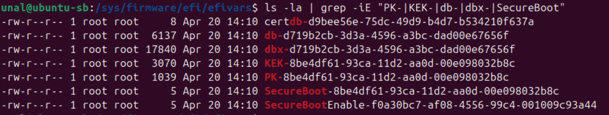

- Each UEFI variable shows up here as a file. Linux uses this interface to talk to the UEFI NVRAM.
- `dbx` is the biggest file — it holds the 370 banned hashes.
- `SecureBoot` is tiny — it is just an on/off flag.
- PK, KEK, db, and dbx are **authenticated variables**. Even root cannot just write into them; I need a properly signed payload, which is what tools like `efi-updatevar` produce.

### 7.2 EFI System Partition (ESP) — Bootloader Files

```bash
ls -la /boot/efi/EFI/
ls -la /boot/efi/EFI/ubuntu/
```

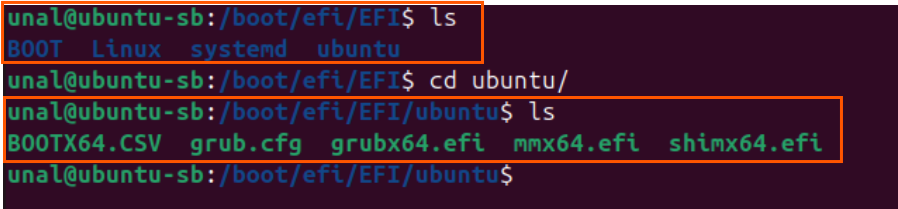

- `shimx64.efi` — the Microsoft-signed bridge. UEFI runs this first.
- `grubx64.efi` — the GRUB bootloader. Shim verifies it.
- `mmx64.efi` — MOK Manager (a tool for Machine Owner Keys).
- `grub.cfg` — GRUB's configuration.
- **After the project:** `shimx64.efi` and `mmx64.efi` are no longer needed. UEFI runs my signed UKI (`my_ubuntu.efi`) directly; signed `grubx64.efi` remains as a fallback.

### 7.3 Kernel and Initramfs

```bash
ls -la /boot/
```

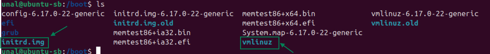

- `vmlinuz-6.17.0-22-generic` — the Linux kernel. I will sign this file in the project.
- `vmlinuz` → a symlink to the current kernel. GRUB and most tools use this short name.
- `initrd.img-6.17.0-22-generic` — the initial ramdisk (initramfs). It holds the early drivers and init scripts the kernel needs at the first boot stage. It stays **unsigned** here; the UKI step ([uki.md](uki.md)) closes this gap by bundling it inside a signed `.efi`.
- `initrd.img` → a symlink to the current initramfs.
- `*.old` files — backups of the previous kernel/initrd, kept in case an update breaks the boot. **Security note:** older kernels still carry their original CVEs (Common Vulnerabilities and Exposures — the public catalog of known security flaws), so a boot-menu downgrade attack remains possible even after key enrollment. Mitigation (out of scope): `apt autoremove --purge` to delete, or `dbx` to revoke specific hashes.
- Other files I see: `config-*` (the kernel build config), `System.map-*` (kernel symbol table, used for debugging), `memtest86+*` (a memory-testing tool), and the `efi/` and `grub/` directories.

### 7.4 Verifying the Current Signatures

**GRUB signature:**

```bash
sbverify --list /boot/efi/EFI/ubuntu/grubx64.efi
```

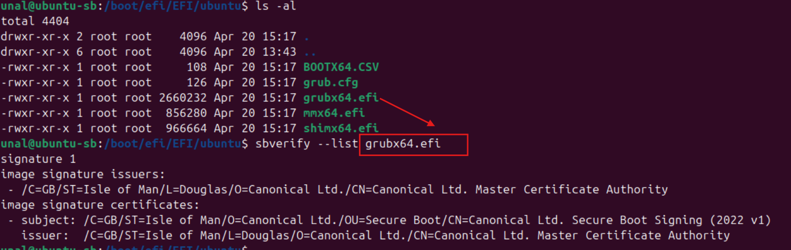

- Issuer: `Canonical Ltd. Master Certificate Authority`
- Subject: `Canonical Ltd. Secure Boot Signing (2022 v1)`
- So GRUB is currently signed by Canonical.

**Kernel signature:**

```bash
sudo sbverify --list /boot/vmlinuz-6.17.0-22-generic
```

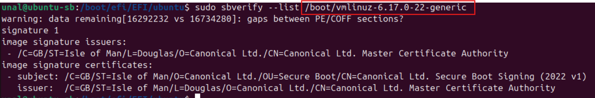

- Issuer: `Canonical Ltd. Master Certificate Authority`
- Subject: `Canonical Ltd. Secure Boot Signing (2022 v1)`
- The kernel is signed with the same Canonical certificate.
- **After the project:** Both outputs will show my name instead of Canonical.

## References

- [UEFI Specification 2.10 — Secure Boot and Driver Signing](https://uefi.org/specs/UEFI/2.10/32_Secure_Boot_and_Driver_Signing.html) — authoritative spec for PK/KEK/db, ESL, and `.auth` formats.
- [Wikipedia — UEFI](https://en.wikipedia.org/wiki/UEFI) — overview of UEFI and Secure Boot.
- [Arch Wiki — UEFI Secure Boot](https://wiki.archlinux.org/title/Unified_Extensible_Firmware_Interface/Secure_Boot) — practical guide with custom key examples.
- [Rod Smith — EFI Bootloaders and Secure Boot](https://www.rodsbooks.com/efi-bootloaders/secureboot.html) — historical and technical context.
- [VirtualBox User Manual](https://www.virtualbox.org/manual/) — VM configuration including UEFI/Secure Boot/TPM options used in Steps 1–4.
- [Claude AI (Anthropic)](https://claude.ai) — used as an interactive assistant for explanations, troubleshooting, and structuring this document.